# Instrument Cluster

This guide will follow my [instrument cluster video](https://www.youtube.com/watch?v=5p8rho_f-Ww) and add a few more details here and there.
It will describe the bulb replacement procedure and the gauges removal.

## Bulb Replacement

This part will cover the replacement of the illumination bulbs.  
All other bulbs on the cluster are replaced in a similar fashion.

### Parts

Here are the parts you will need to replace your bulbs.
I added some AliExpress links which should contain relevant parts, but I haven't purchased from any of those specific listings.

| Quantity | Part | Link |
| --- | --- | --- |
| 5 | T10 bulb | [AliExpress](https://www.aliexpress.com/item/1005003561133767.html) |
| 1 | T5 bulb | [AliExpress](https://www.aliexpress.com/item/1005010577609117.html) |
| 5 | T10 socket (optional) | [AliExpress](https://www.aliexpress.com/item/1005005826817234.html) |
| 1 | T5 socket (optional) | [AliExpress](https://www.aliexpress.com/item/32818566558.html) |

### Procedure

1. If you haven't removed the cluster yet, watch the [instrument cluster removal video](https://www.youtube.com/watch?v=cKarO9A21Zw).
2. Place the cluster with the gauges facing down so you can access the bulbs on the back. Be careful to not damage the odometer reset rod.
3. Remove the highlighted sockets by twisting them counter-clockwise and then pulling out
   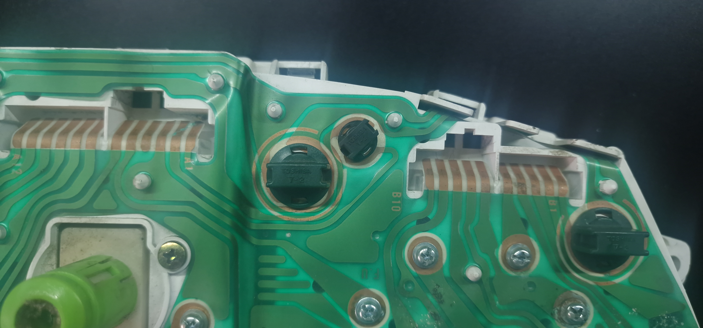
   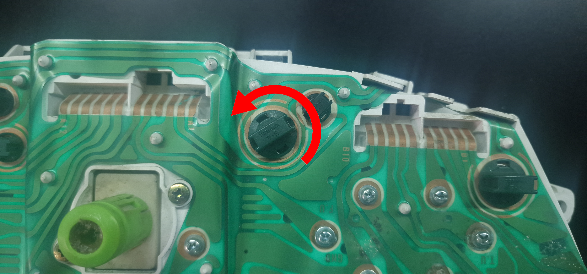
   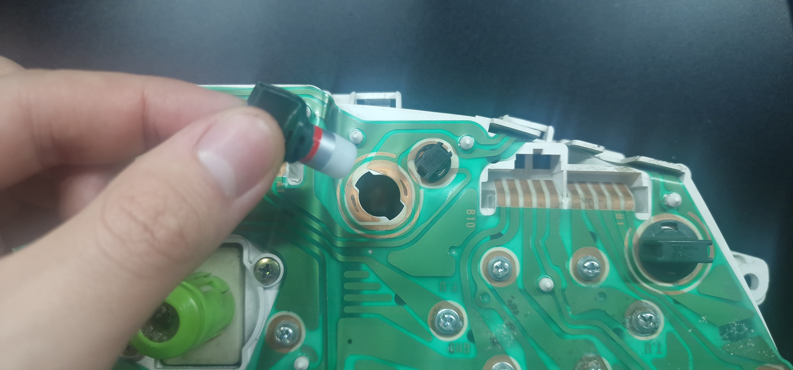
4. Pull out the bulbs from within their sockets and put a new bulbs in. Alternatively if you also bought new sockets, you can use those.
5. Return the sockets to their place and twist clock-wise to lock them in
Note: If the sockets are loose or you noticed damage copper on the PCB, the bulb's may not work or they may flicker. See Copper Contact for possible remedy

### Copper Contact

Damaged or corroded copper can prevent the bulbs from working properly or at all. Whenever you use LEDs or regular bulbs, they both get quite hot in use and that can affect the quality of the contact which may cause the bulbs to work when cold and stop when hot or vice versa.

Same thing can be caused by the socket not being tight enough. In this case, you should try replacing the socket and if that doesn't help, you can add some material in-between the socket and the PCB. It has to be something conductive like copper tape or some solder. I would leave soldering as a last resort and try a copper tape first.

The copper tape can also help resolve the damaged copper symptoms.

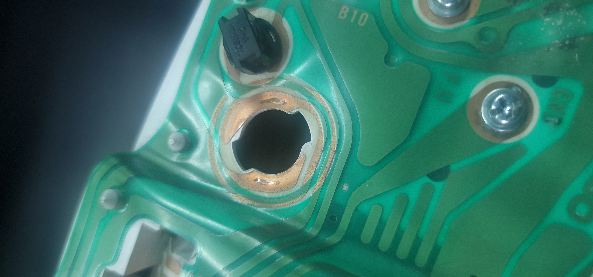

### Bulb Orientation

If you use LEDs instead of regular bulbs, you will need to pay attention to their orientation. IF they are in the wrong orientation there will be no damage, but the LEDs won't work.
There are two options to get it right:
1. Put the LEDs in whatever way and then connect the cluster to the car, turn on the lights and see which LEDs are not lighting up. Simply twist their socket out and put them in the other way. Once all LEDs seem to work fine, you can turn off the lights and finish installing the cluster back.
2. Do the same thing as in 1. but at home with a 12V power supply. (put link on this entire line to the Testing Illumination at Home)

## Testing Illumination at Home

For testing the illumination of the cluster at home you should additionally prepare:
- 12V power supply (at least 30 Watts)
- fuse 2A or 5A
- Wires

### Procedure

Warning: Only proceed with this test if you know what you are doing. If you don't have experience with electronics this can be dangerous and you could also destroy your cluster.

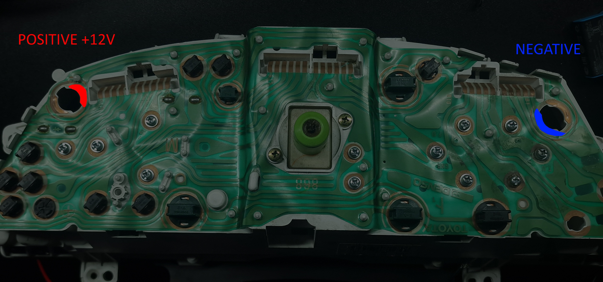

1. Connect the positive wire of your power supply to a fuse and then connect the other end of the fuse to the Positive point
2. Connect the negative wire of your power supply to the Negative point
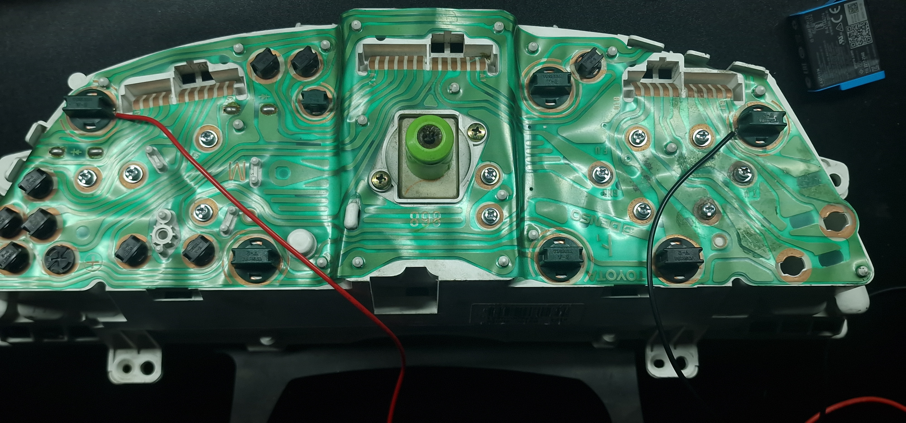

Note: You can use the bulb sockets to clamp down your wire to the connection points
3. Verify the connections are all good and nothing is shortcircuiting and then turn on your power supply
4. Inspect if each bulb is lighting up properly. Easier done in darkness or if you remove the front plastics so you can see the bulbs directly.

[LED swap demonstration video](../../images/guides/instrument-cluster/led_swap_demo.mp4)

## Gauge Removal

### Procedure

1. Remove the relevant screws from the back. Either all if you wish to remove all gauges, or just the screw cluster of a singular gauge
   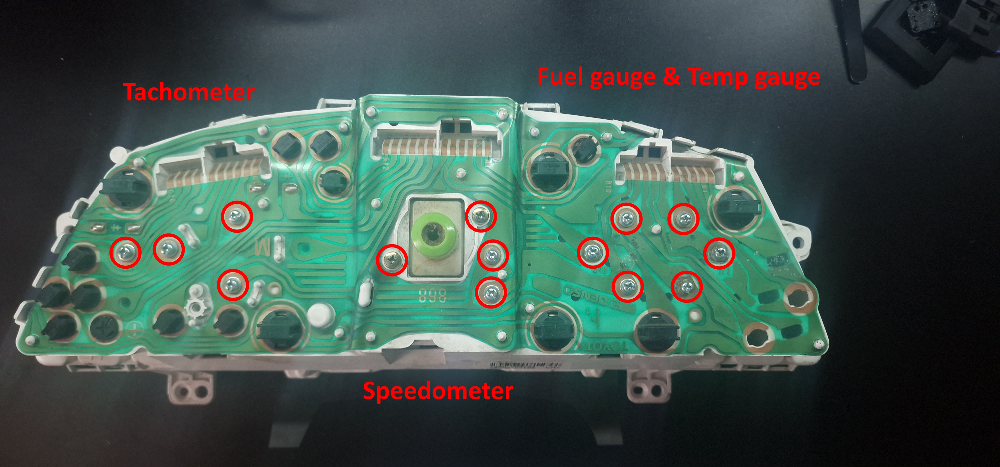
2. Flip the cluster over and remove the 4 screws holding down the plexiglass shield
   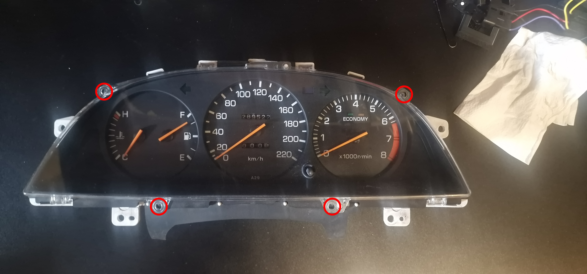
3. Remove the plexiglass shield by popping out its plastic clips
4. Remove the little clamp shield by popping out its 2 plastic clips
   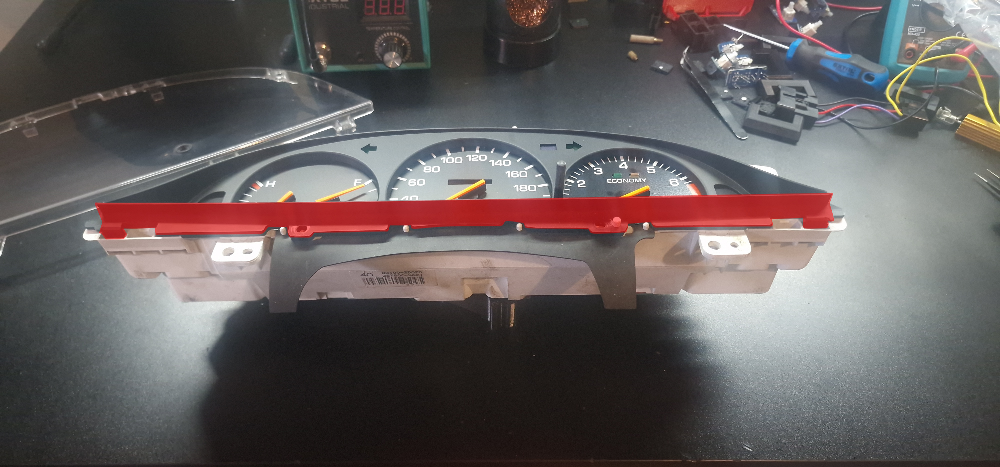
5. Remove the main plastic cover by popping out its plastic clips
   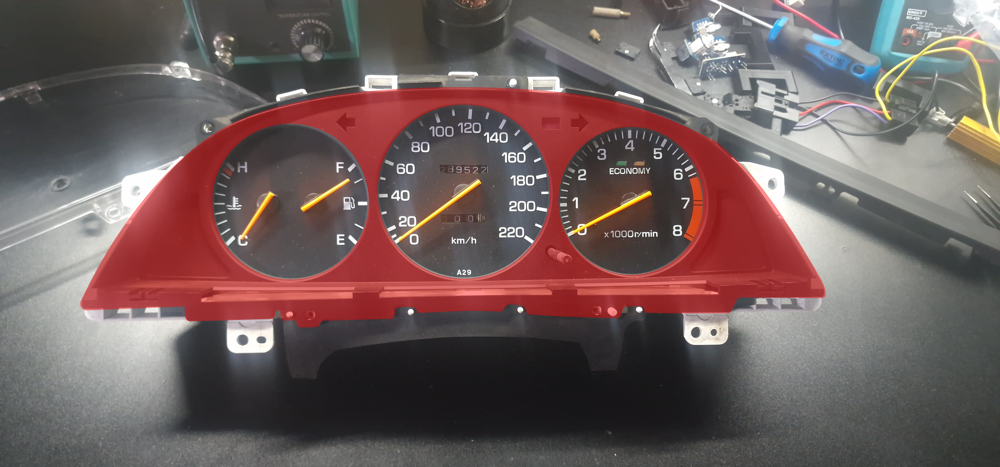
6. The gauges you have unscrewed initially should now be loose and removable by hand
   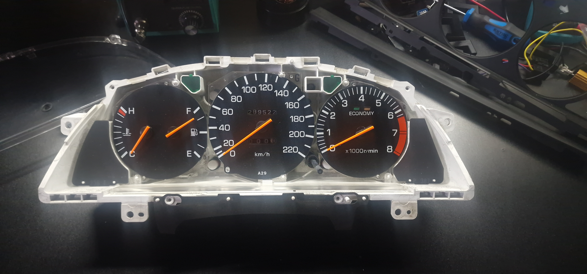
7. Remove gauges as needed to replace or repair.
   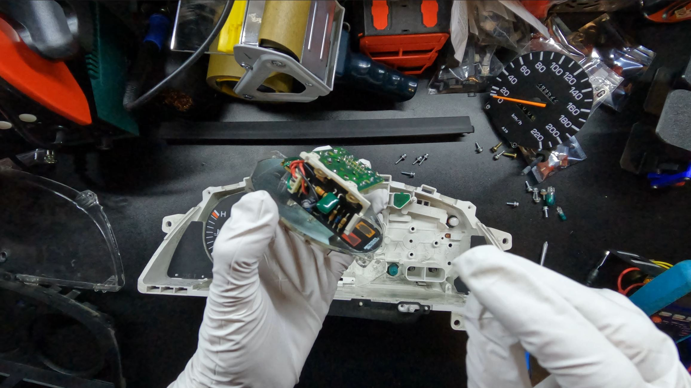
