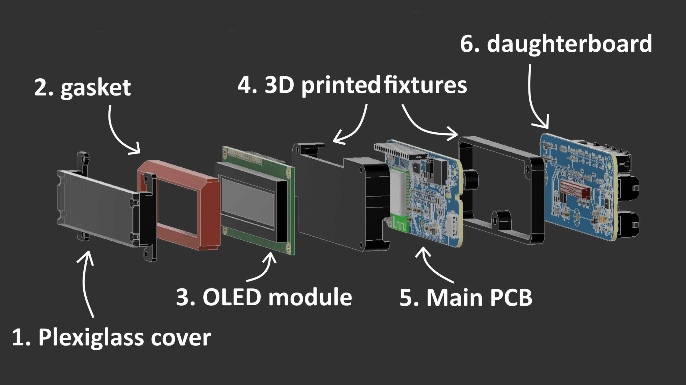

# OLED Display Module

Status: In Development

Plug-and-play replacement for the factory clock module in the center dash above the vents.
Development started in May 2026 and is expected to complete sometime in 2026.

> **IN DEVELOPMENT**
> This product is still being developed.

> **SEPTEMBER 2026 UPDATE**
> I have verified all features on a prototype, but I have decided to redesign the module from the ground up. There are issues with space constraints, and it also ended up being more expensive than I hoped for. I plan to resolve both problems with the redesign.

## Features

### OLED Display
Module comes with a 16 x 100 px OLED graphical display that delivers superior brightness and viewing angles compared to a traditional LCD display.
There will be several LED colors to choose from such as Red, Green, Blue, White and Yellow.

### Precise Time
Time accuracy with < 1s precision. You will never have to recalibrate the time ever again.
Automatic Winter/Summer time changes based on geographical location.

### GPS
Integrated GPS module:
- Precise time synchronization in case the RTC ever drifts
- GPS speed
- Trip travel distance
- Altitude information

### Voltage Measurement
Integrated battery voltage level monitoring. 
Up to 2 additional external voltage sensing circuits

### Phone Setup
Possibility to modify and configure the module via phone.

### Temperature Monitoring
TAG: Additional parts
Up to 4 NTC temperature sensors to measure outside and inside temperatures.

### Current Sensor
TAG: Additional parts
Connection for an external Hall Effect sensor to measure current up to 100 Amps.
For example to measure total current draw of the alternator/battery.

### CO2 Sensor
TAG: Additional parts
Connection for an external O2 Sensor such as SCD41 to monitor CO2 levels in the cabin.

> **ADDITIONAL PARTS**
> These features are optional and require additional installations such as routing cables and securing sensors.

## Module Overview

1. **Plexiglass cover:** Dark-tinted plexiglass cover that protects the display.
2. **Gasket:** 3D printed gasket that helps prevent dust from getting between the display and plexiglass cover.
3. **OLED Module:** 16 x 100 px OLED module.
4. **3D printed fixtures:** 3D printed covers with heat-set inserts.
5. **Main PCB:** Contains the main modules, including the ESP32-S3, GNSS, ADS, and RTC. Also includes the USB-C connector for firmware flashing.
6. **Daughterboard:** Houses the external connectors and power supplies.
