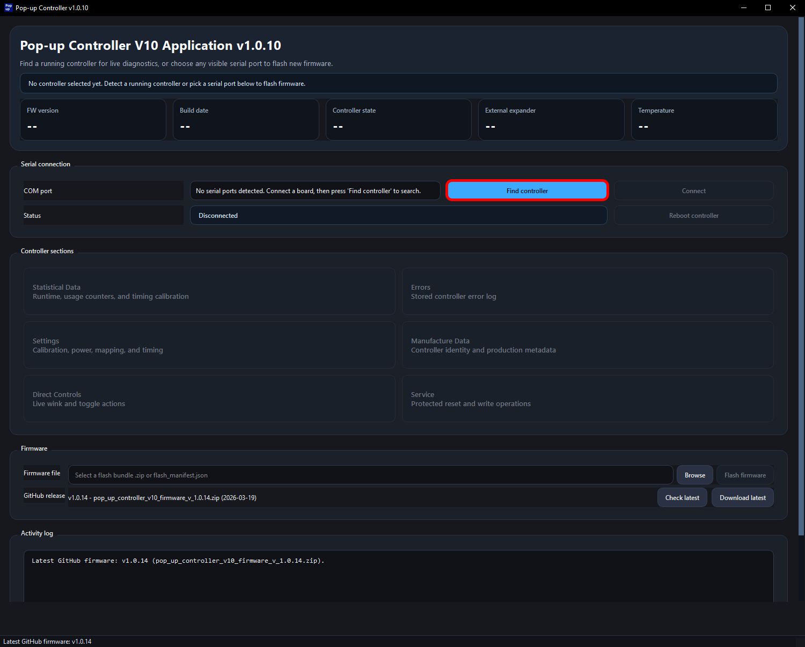
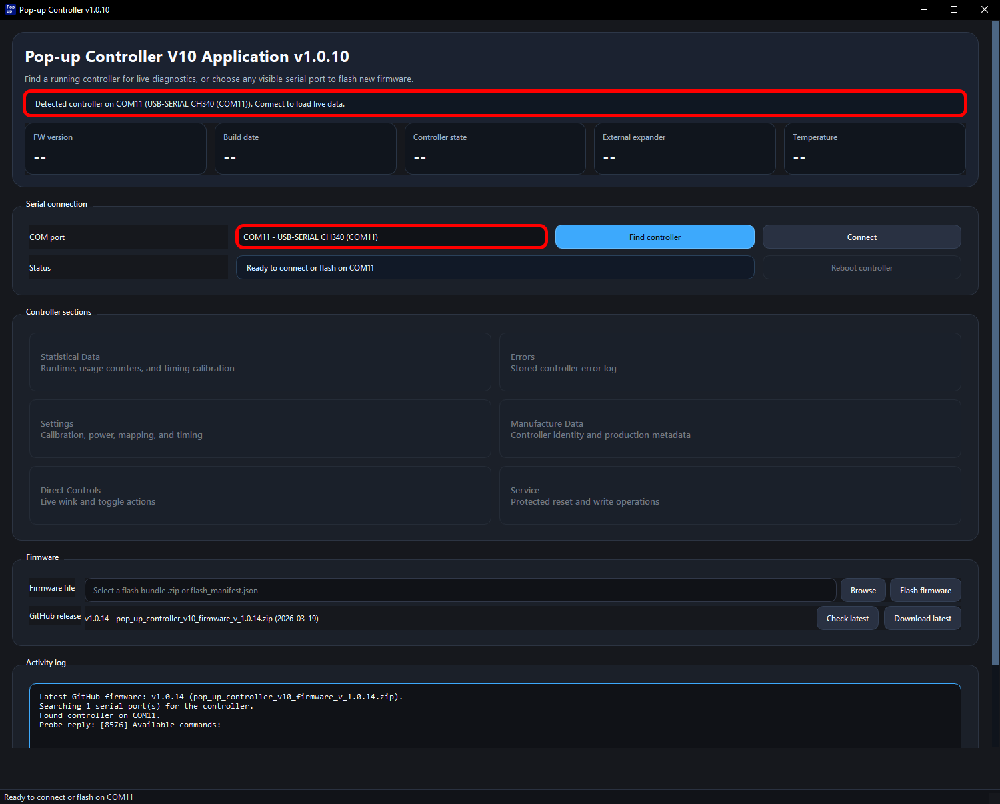
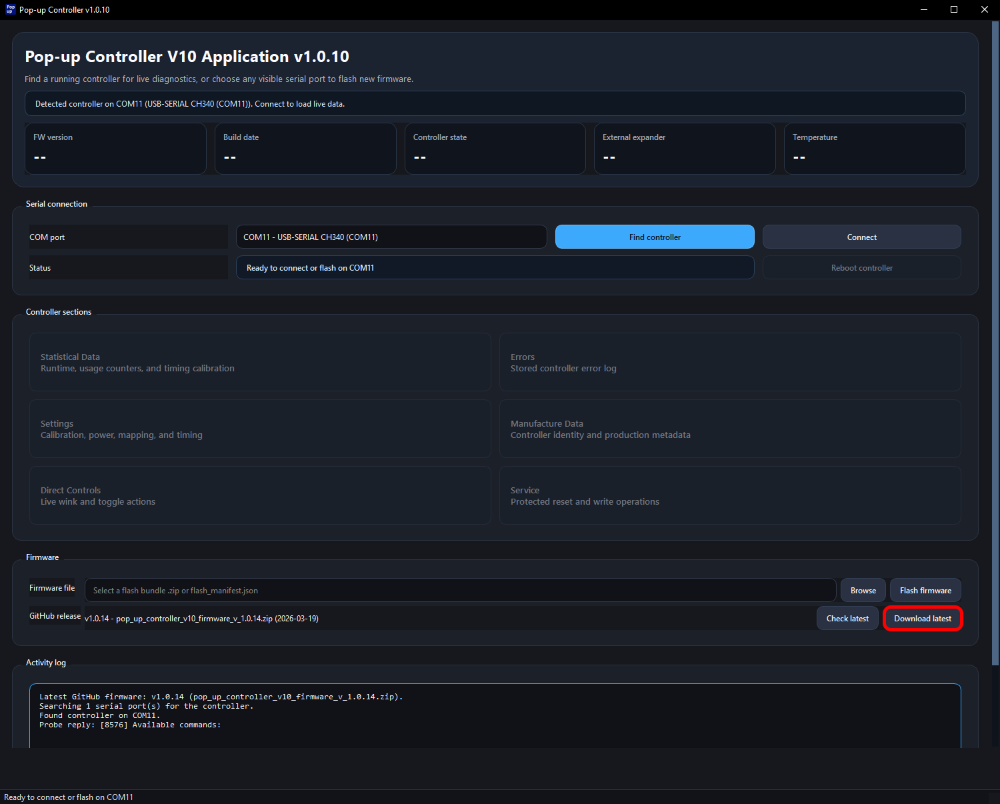
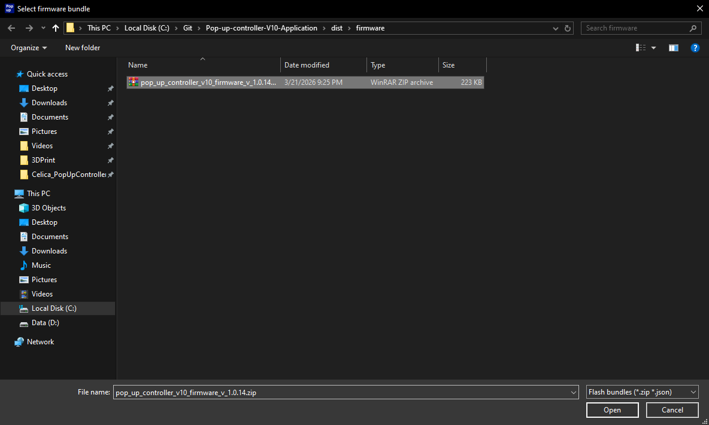
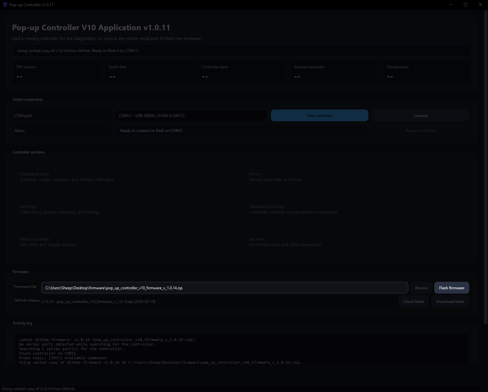
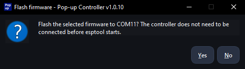
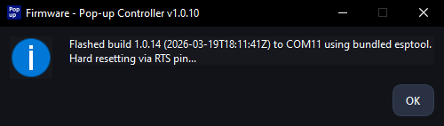
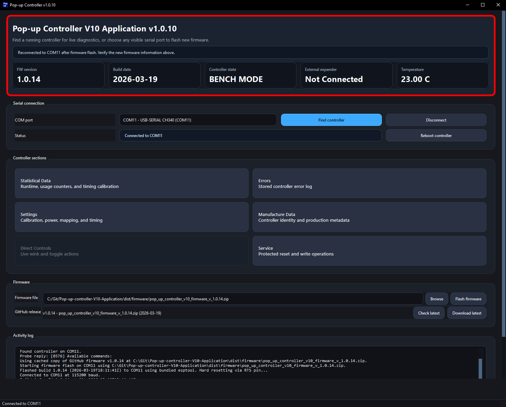

# App Flashing Guide

This guide walks through flashing firmware to a Pop-up Controller V10 by using the desktop app.

## Prerequisites

1. [Download](https://github.com/sheep-celica/Pop-up-controller-V10-Application/releases) the latest release of the desktop app.
2. Have a USB-C cable that supports data transfer. A charge-only cable will not work.
3. Have a Pop-up Controller V10 ready. Any hardware revision is fine.
4. Use a Windows PC, ideally Windows 10 or Windows 11.

## Preparation

Prepare the USB-C cable and the app files listed above.

Desktop app downloads: [sheep-celica/Pop-up-controller-V10-Application releases](https://github.com/sheep-celica/Pop-up-controller-V10-Application/releases)

The firmware can be flashed either with the controller connected directly to your PC or while it is installed in the car.

If the controller is installed in the car, set the headlight switch to the `HOLD` position before starting.

## Step Overview

Use this quick summary to jump to the part you need.

Most users will use **Step 4** to download the newest firmware automatically. Use **Step 5** instead if you already have a firmware `.zip` file.

1. [Open the desktop app](#step-1-open-the-desktop-app) - Launch the app and continue past any Windows warning.
2. [Find the controller](#step-2-find-the-controller) - Ask the app to search for the connected controller.
3. [Wait for detection](#step-3-wait-for-detection) - Confirm that the controller information appears.
4. [Download the latest firmware](#step-4-download-the-latest-firmware) - Let the app fetch and select the newest firmware release.
5. [Browse for a firmware zip](#step-5-browse-for-a-firmware-zip) - Manually select a downloaded firmware package instead.
6. [Start the flash](#step-6-start-the-flash) - Begin writing the selected firmware to the controller.
7. [Confirm the operation](#step-7-confirm-the-operation) - Approve the confirmation dialog.
8. [Wait for completion](#step-8-wait-for-completion) - Let the flash finish and wait for the success message.
9. [Verify the controller reconnects](#step-9-verify-the-controller-reconnects) - Check that the controller reconnects and the displayed information looks correct.

## Detailed Steps

### Step 1: Open the desktop app

Double-click the extracted `.exe` file to open the app.

> **Note:** Windows SmartScreen or antivirus software may warn you about the app because it is not code-signed.

### Step 2: Find the controller

The main app window should open. Click **Find controller**.

### Step 3: Wait for detection

Wait a few seconds for the app to detect the controller and update the device information.

### Step 4: Download the latest firmware

Click **Download latest** to automatically download and select the latest firmware file.

### Step 5: Browse for a firmware zip

If needed, click **Browse** instead to select a firmware `.zip` file manually.

Firmware release downloads: [sheep-celica/pop-up-controller-v10 releases](https://github.com/sheep-celica/pop-up-controller-v10/releases)

### Step 6: Start the flash

After the firmware file has been loaded, click **Flash firmware** to begin the flashing process.

### Step 7: Confirm the operation

When prompted to confirm the flash operation, click **Yes**.

### Step 8: Wait for completion

After about 5 to 10 seconds, the flash should complete and a success dialog should appear.

### Step 9: Verify the controller reconnects

A few seconds later, the controller should reconnect automatically. Verify that the displayed information looks correct.

