# App Flashing Guide

> **Warning:** Complete the [App Setup Guide](app-setup.md) first.

## Prerequisites

1. [Download](https://github.com/sheep-celica/Pop-up-controller-V10-Application/releases) the latest release of the desktop app.
2. Have a USB-C cable that supports data transfer. A charge-only cable will not work.
3. Have a Pop-up Controller V10 ready. Any hardware revision is fine.
4. Use a Windows PC, ideally Windows 10 or Windows 11.

## Preparation

Prepare the USB-C cable and the app files listed above.

Desktop app downloads: [sheep-celica/Pop-up-controller-V10-Application releases](https://github.com/sheep-celica/Pop-up-controller-V10-Application/releases)

If you plan to flash the controller while it's installed in the car, unplug the main 12 pin connector before you connect the USB cable.

## Procedure

### Step 1: Open the desktop app

Double-click the extracted `.exe` file to open the app.

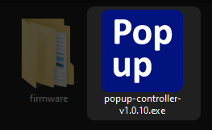

> **Info:** Windows SmartScreen or antivirus software may warn you about the app because it is not code-signed.

### Step 2: Find the controller

The main app window should open. Click **Find controller**.

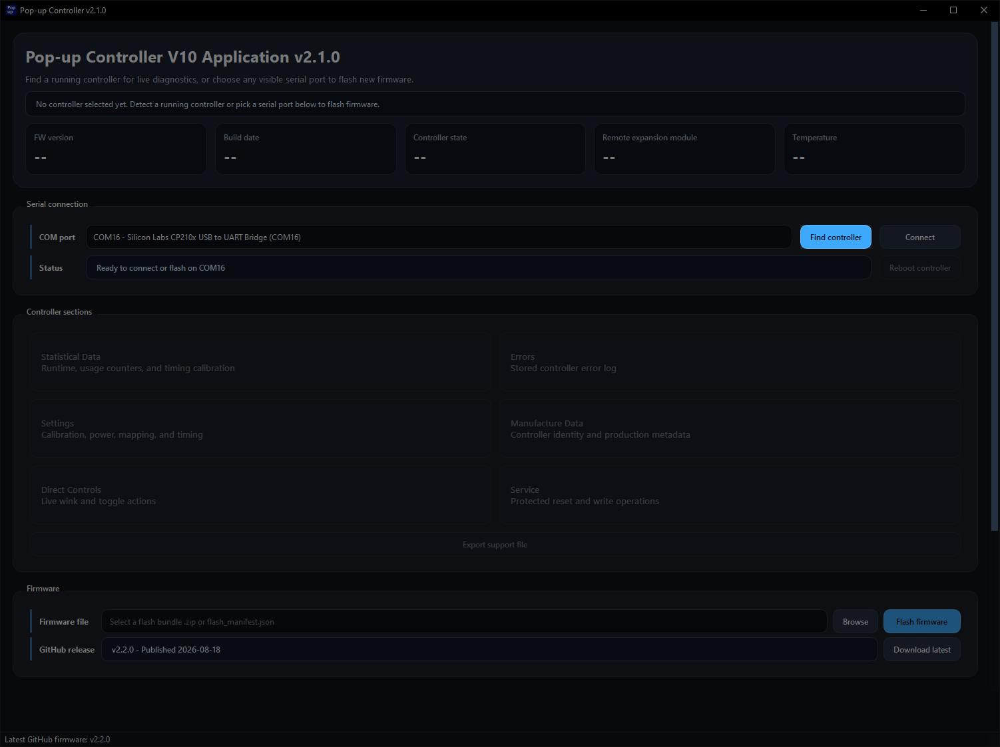

### Step 3: Wait for detection

Wait a few seconds for the app to detect the controller and update the device information.

> **Info:** If you run into detection issues here, check [If the Controller Is Not Detected](app-setup.md#if-the-controller-is-not-detected) in the App Setup Guide.

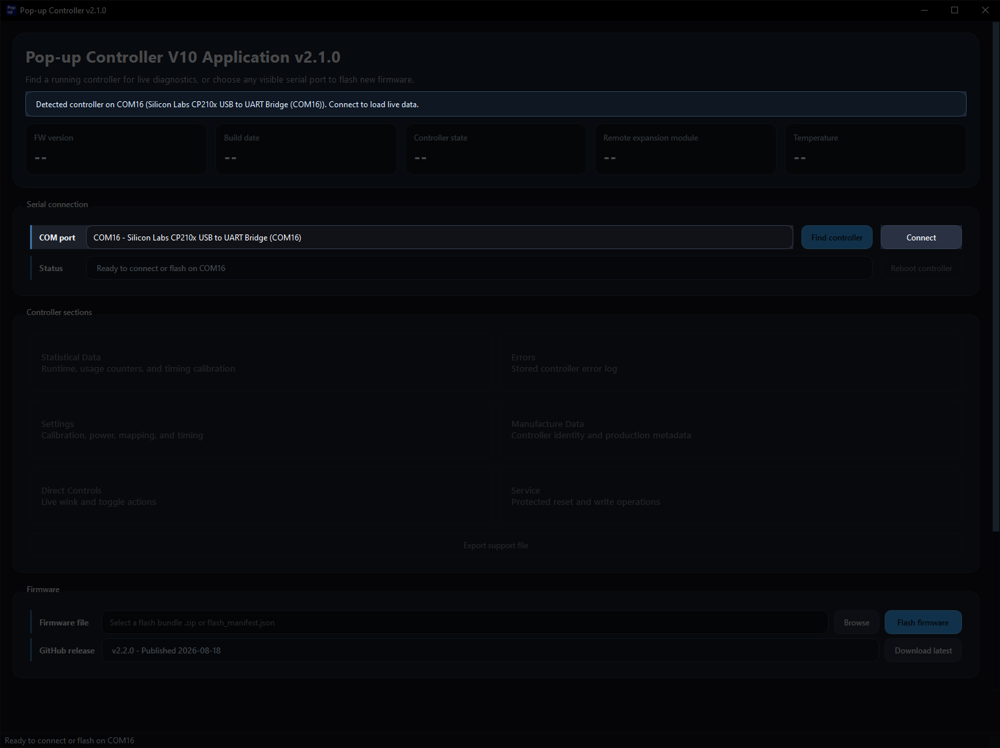

### Step 4: Connect to the controller

Click the **Connect** button and wait until the controller is connected.

> **Info:** The FW version and Build date cards will become yellow if there is newer firmware available for download.

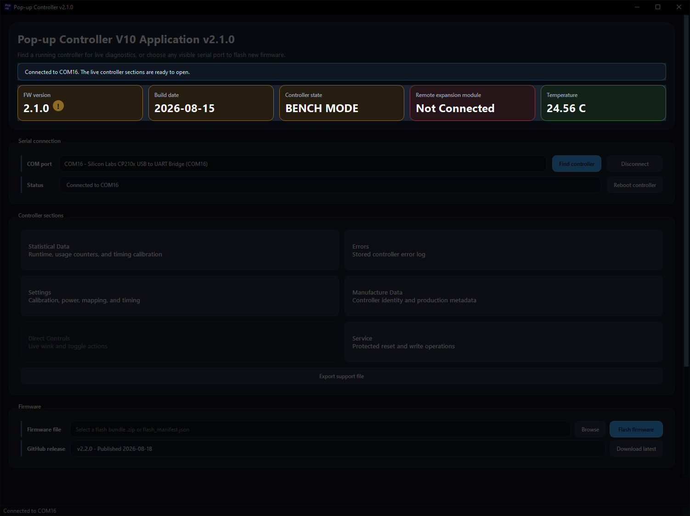

### Step 5: Download the latest firmware

Click **Download latest** to automatically download and select the latest firmware file.

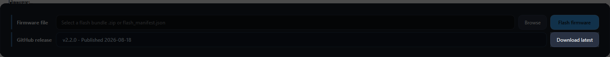

### Step 6: Browse for a firmware zip

If needed, click **Browse** instead to select a firmware `.zip` file manually.

Firmware release downloads: [sheep-celica/pop-up-controller-v10 releases](https://github.com/sheep-celica/pop-up-controller-v10/releases)

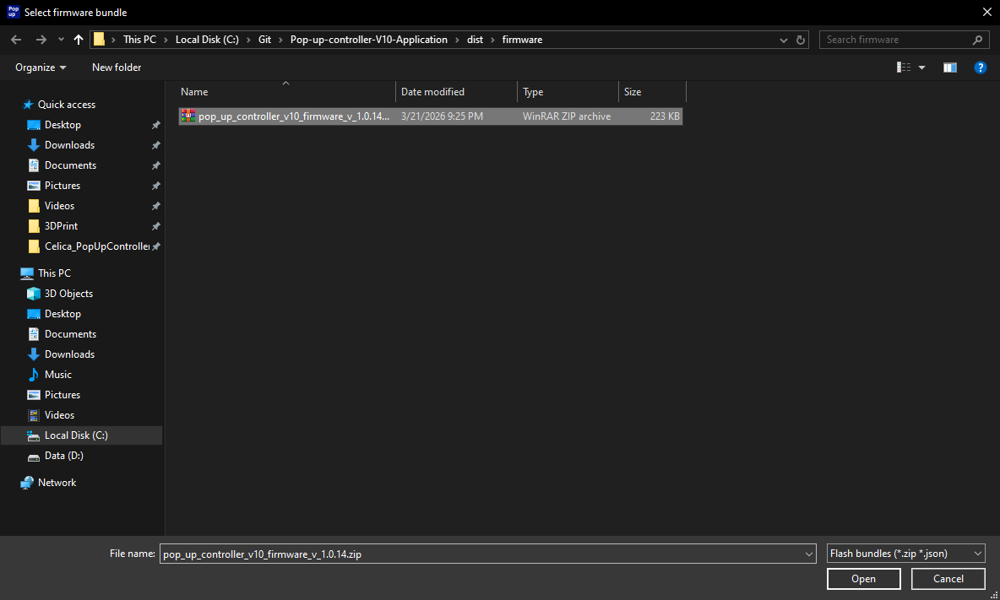

### Step 7: Start the flash

After the firmware file has been loaded, click **Flash firmware** to begin the flashing process.

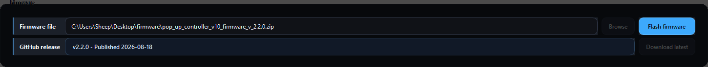

### Step 8: Confirm the operation

When prompted to confirm the flash operation, click **Yes**.

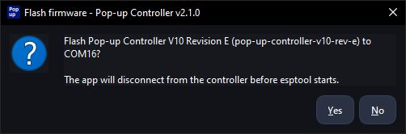

### Step 9: Select Firmware Board

> **Serious Warning:** If this screen opens, you have either not connected to the controller or the controller is running firmware lower than 2.0.0. In this case, contact me first for which option to select. Selecting the wrong option may damage the controller.

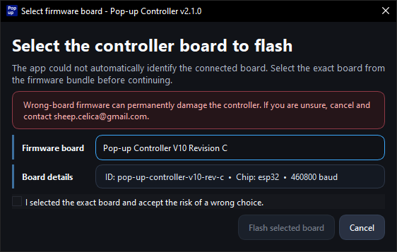

### Step 10: Wait for completion

After about 5 to 10 seconds, the flash should complete and a success dialog should appear.

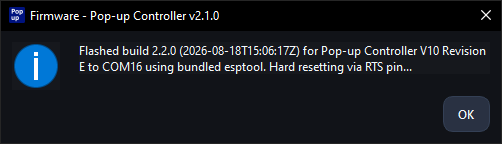

### Step 11: Verify the controller reconnects

A few seconds later, the controller should reconnect automatically. Verify that the displayed information looks correct.

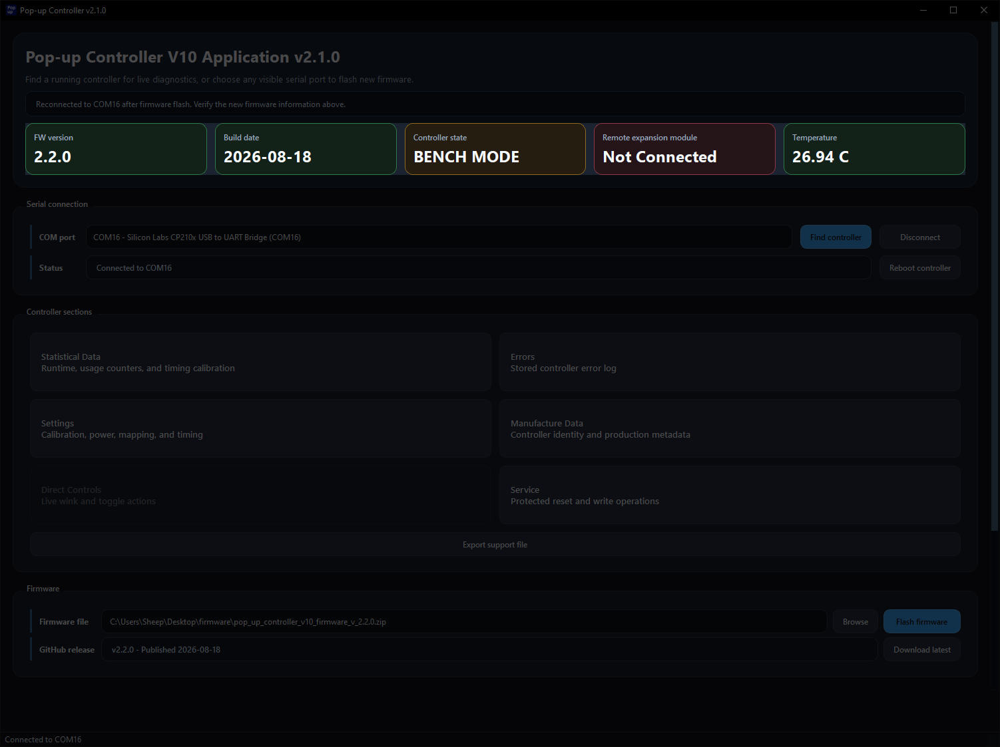
