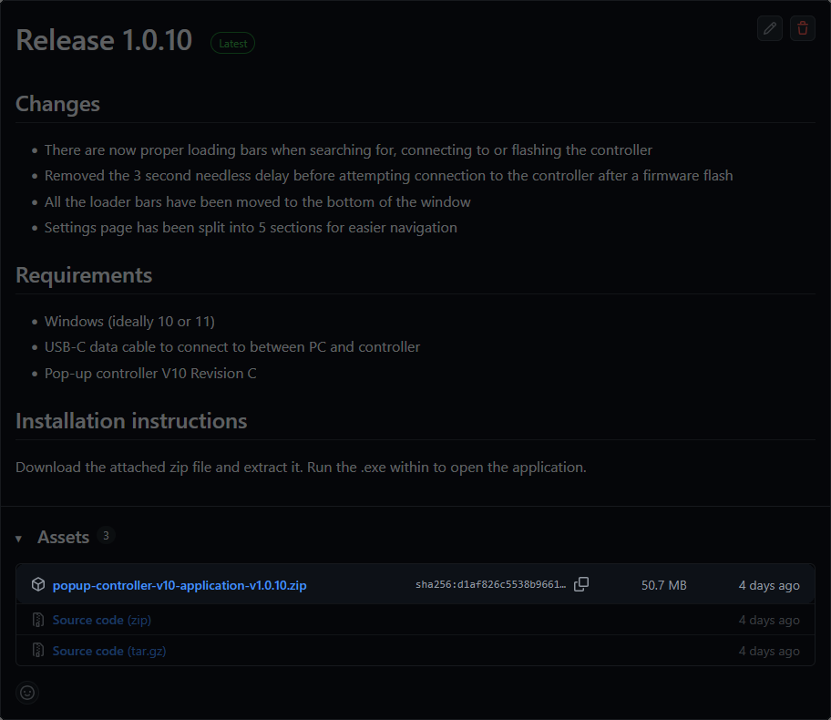
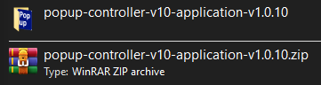
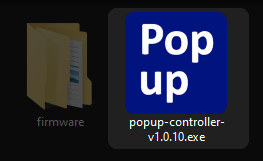
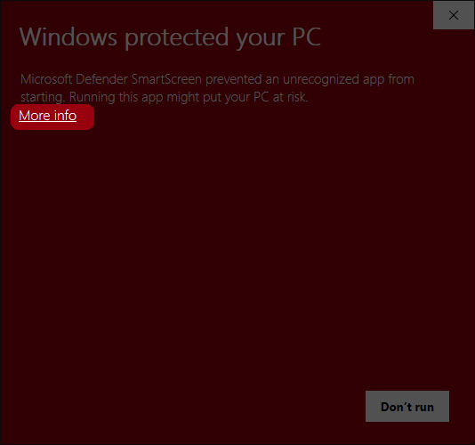
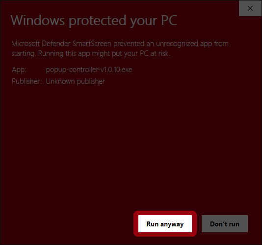
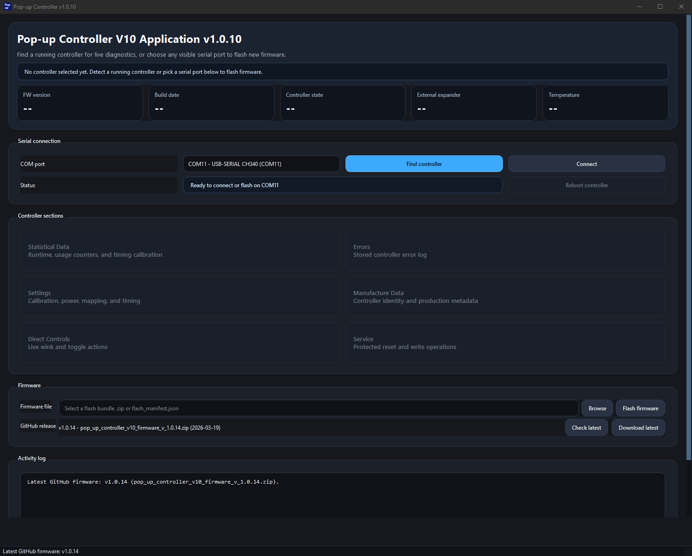
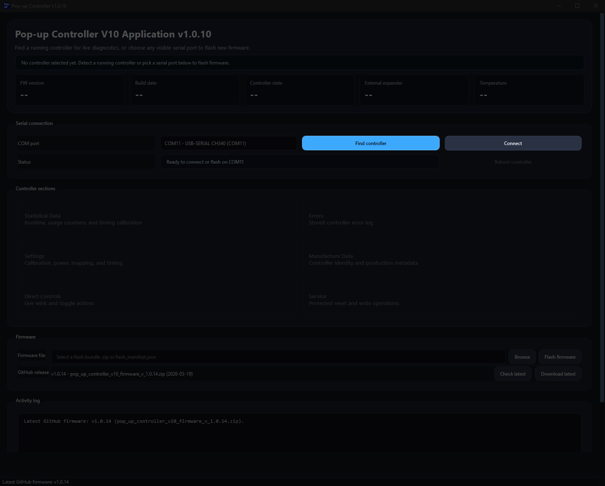
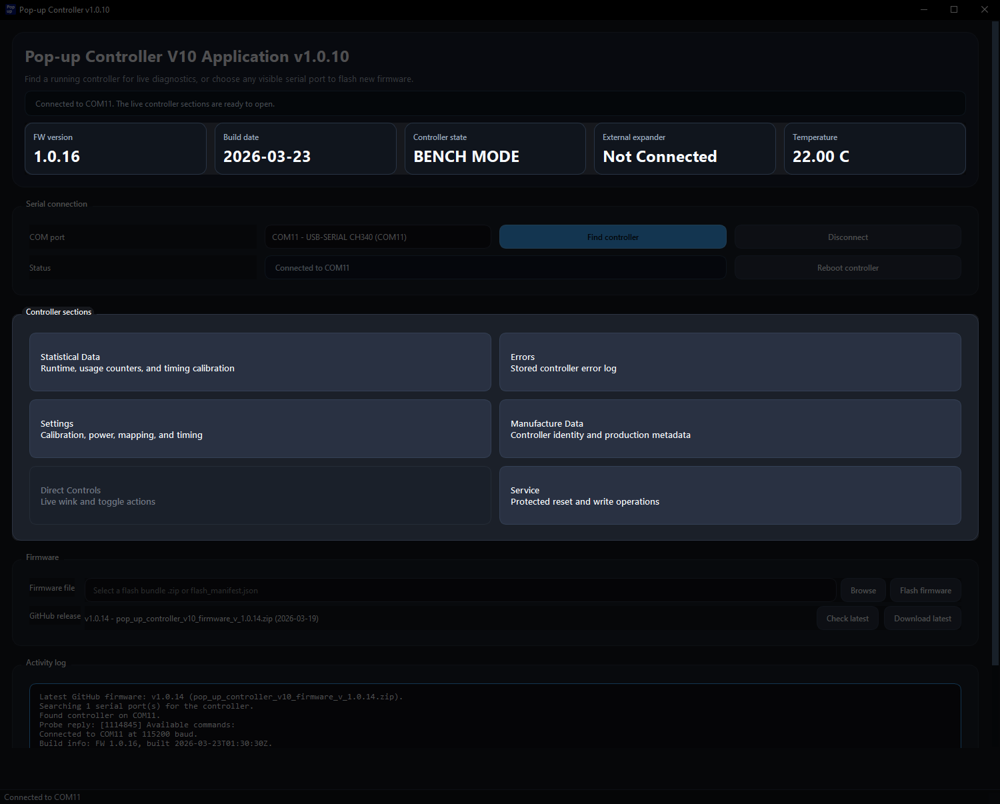

# App Setup Guide

This guide covers downloading the Pop-up Controller V10 desktop app, preparing the controller connection, and confirming that the app can detect the controller.

## What You Need

- A Windows 10 or Windows 11 PC
- The latest desktop app release
- A USB-C cable that supports data transfer
- A Pop-up Controller V10

## Step Overview

1. Download the latest desktop app release.
2. Extract the downloaded files.
3. Open the extracted `.exe`.
4. Connect the controller with a `USB-C` data cable.
5. Open the app and connect to the controller.
6. Confirm that the controller information appears.

## Download the App

Download the latest release here:

[sheep-celica/Pop-up-controller-V10-Application releases](https://github.com/sheep-celica/Pop-up-controller-V10-Application/releases)

## Extract the downloaded files

Extract the downloaded release before opening the `.exe` file.

## Open the extracted `.exe`

Open the extracted `.exe` file.

> **Note:** Windows SmartScreen or antivirus software may warn you about the app because it is not code-signed.
>
> If Windows shows the protection warning, click **More info** and then **Run anyway**.

The following window should open:

## Connect the Controller

Connect your controller to your computer.

You can connect the controller directly to your PC or while it is installed in the car.

Use a USB-C cable that supports data transfer. A charge-only cable will not work.

## Connect to the Controller

Open the desktop app and click **Find controller**.

Once the controller is found, click **Connect**.

Wait a few seconds for the app to detect the controller and update the device information.

## If Detection Fails

- Check that the USB-C cable supports data transfer
- Reconnect the controller and try **Find controller** again
- Close and reopen the app, then try again
- Try different USB ports on your PC
- Last resort is to attempt installation of CH340 drivers

## Next Steps

- For firmware updates, continue with the [App Flashing Guide](app-flashing.md)
- For day-to-day features, continue with the [App Usage Guide](app-usage.md)
