# App Usage Guide

This guide is the technical reference for the Pop-up Controller V10 desktop app after the initial setup is complete.

## Start Here

Before using any instructions in this guide, complete the [App Setup Guide](app-setup.md).

This guide assumes:

- The desktop app is already downloaded and opens correctly
- The controller can be found and connected in the app
- The controller information appears normally after connection

## Guide Sections

1. Basic Information
2. Serial Connection
3. Statistical Data
4. Settings
5. Direct Controls
6. Errors
7. Manufacture Data
8. Service
9. Firmware

## Basic Information

This section covers the header shown near the top of the main app window after the controller is connected.

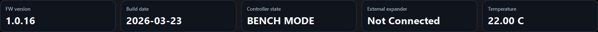

### Header Values

- **FW version:** Shows the firmware version currently running on the connected controller.
- **Build date:** Shows the build date of the currently running firmware.
- **Controller state:** Current mode of the controller.
- **External:** Shows the `I2C` address of the remote module.
- **Temperature:** Controller board temperature.

### Controller States

- **BENCH MODE:** Voltage < 7 Volts. Controller runs in limited functionality, pop-up control is disabled.
- **RUNNING:** Controller is running in the standard mode as is expected in the car.

## Serial Connection

This section will explain COM port selection, finding the controller, connecting, disconnecting, and reconnecting.

### Planned Parts

1. COM port selection
2. Find controller
3. Connect and disconnect
4. Reconnect behavior

## Statistical Data

This section covers the Statistical Data dialog.

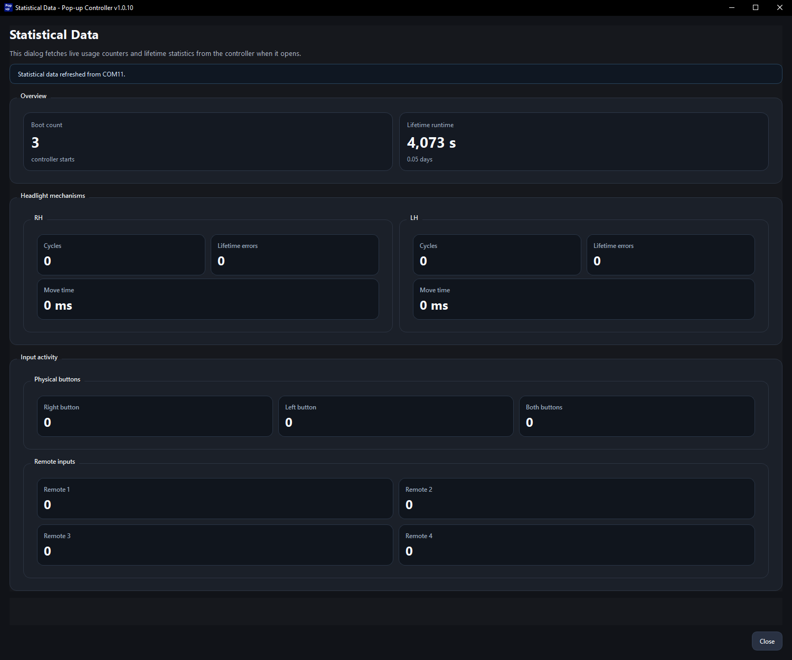

### Main Areas

- **Runtime:** The total controller runtime along with boot counter.
- **Pop-up statistics:** Shows total pop-up cycles, runtime, and errors.
  Note: This includes cleared error codes.
- **Input activity:** Shows activity counters for physical buttons and remote inputs.

## Settings

This section covers the Settings dialog overview and the individual settings categories.

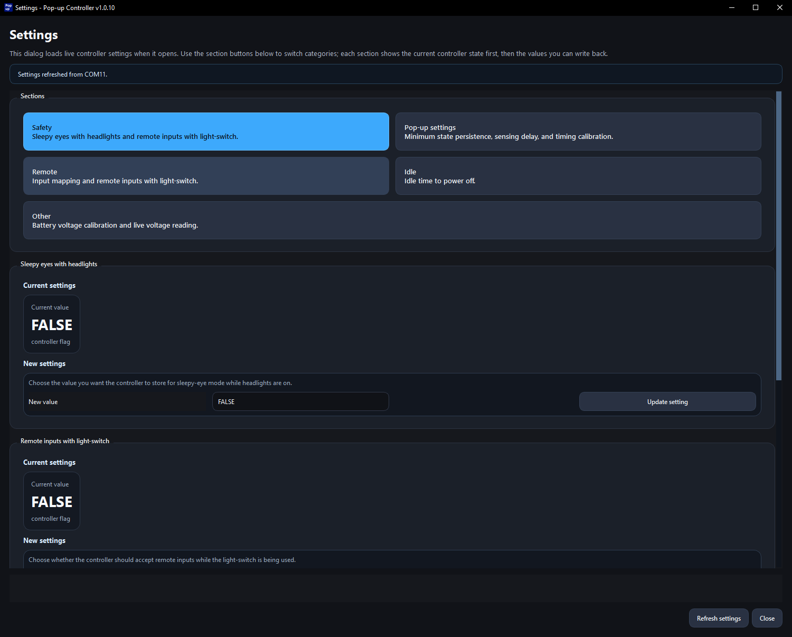

### Safety

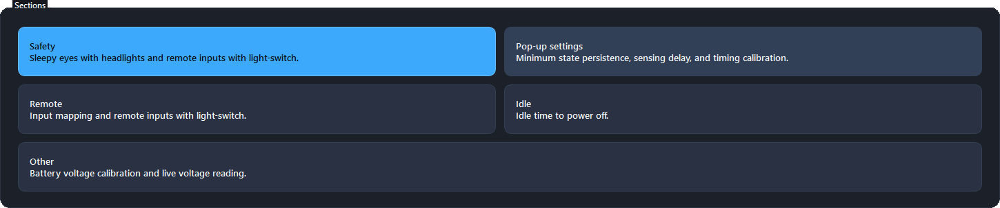

Detailed parameter cards for this category will be added here.

### Pop-up Settings

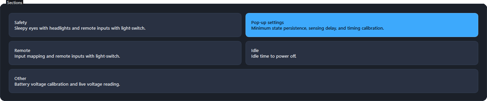

Detailed parameter cards for this category will be added here.

### Remote

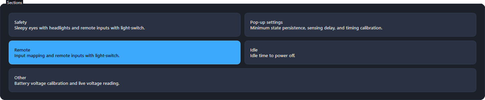

Detailed parameter cards for this category will be added here.

### Idle

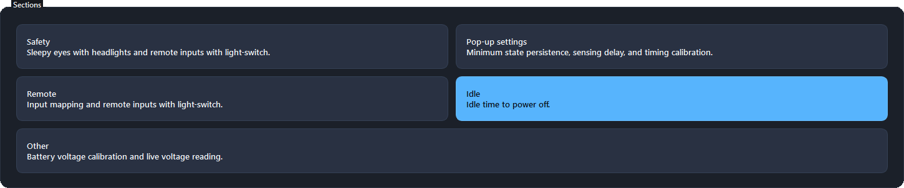

Detailed parameter cards for this category will be added here.

### Other

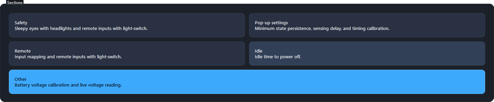

Detailed parameter cards for this category will be added here.

## Direct Controls

This section will explain the direct-control actions that can be triggered from the app.

### Planned Parts

1. Direct Controls overview
2. When to use direct controls
3. Safety while testing

## Errors

This section covers the Errors dialog.

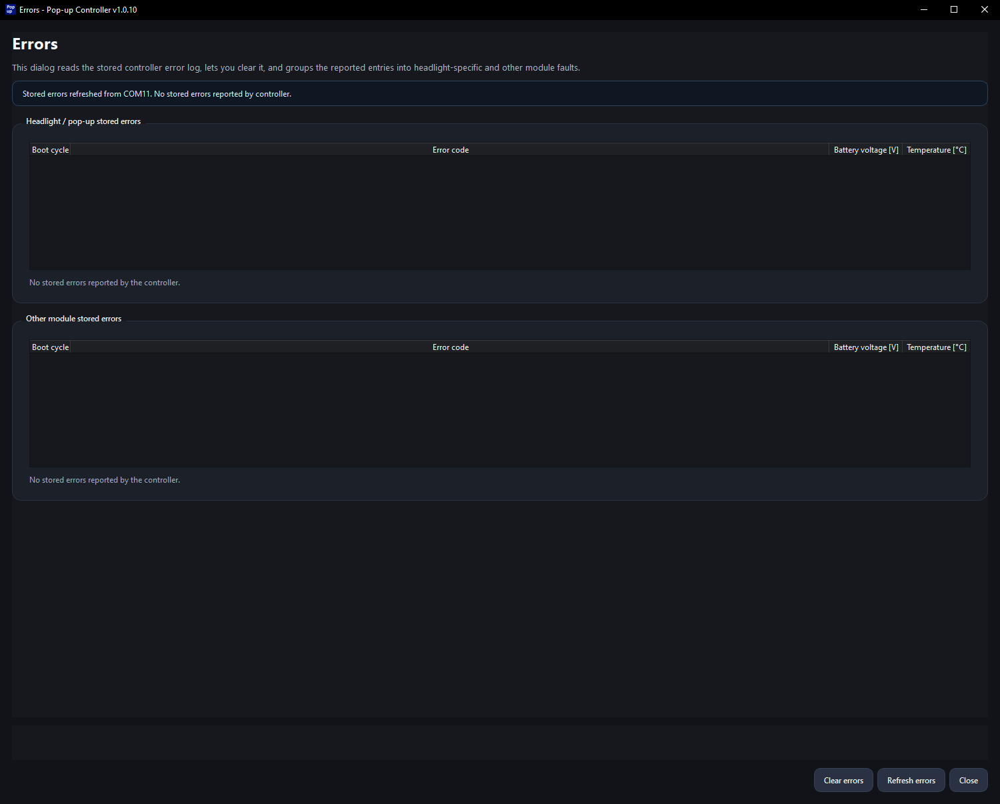

### Main Areas

- **Headlight / pop-up stored errors:** Shows stored errors related to the pop-up mechanisms.
- **Other module stored errors:** Shows other stored controller errors that do not belong to the pop-up mechanism section.
- **Actions:** The dialog includes actions for clearing errors, refreshing the error list, and closing the window.

## Manufacture Data

This section covers the Manufacture Data dialog.

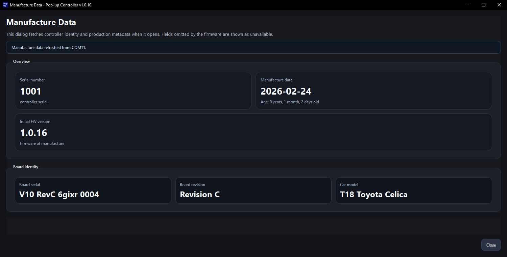

### Main Areas

- **Overview:** Shows serial number, manufacture date, and initial firmware version.
- **Board identity:** Shows board serial, board revision, and car model.
- **Typical use:** Useful for confirming controller identity or answering support questions.

## Service

This section covers the Service access dialog.

Contains service actions intended during manufacturing to load manufacturing data and setup calibrations.

**Note:** This section is not intended for users.

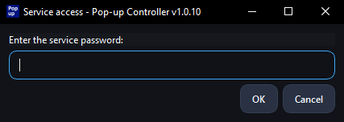

## Firmware

This section will explain the firmware area in the app and how it relates to the separate flashing guide.

Detailed firmware update instructions belong in the [App Flashing Guide](app-flashing.md).

### Planned Parts

1. Firmware area overview
2. Choosing a firmware source
3. Hand-off to the App Flashing Guide
