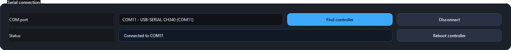
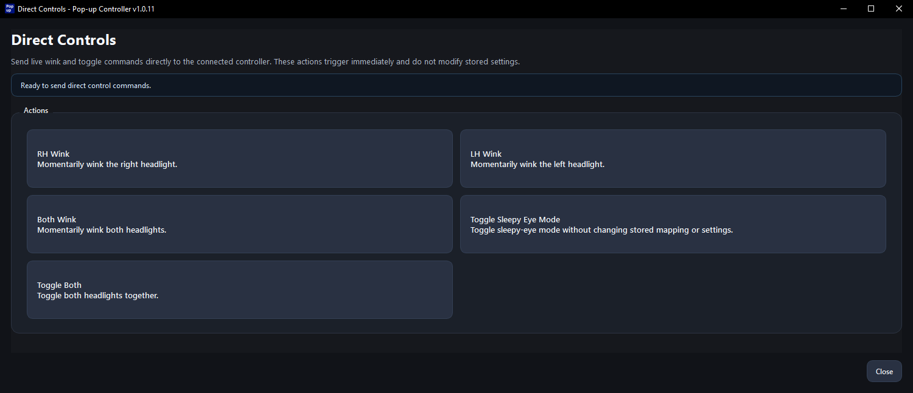
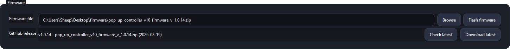

# App Usage Guide

This guide is the technical reference for the Pop-up Controller V10 desktop app after the initial setup is complete.

## Start Here

Before using any instructions in this guide, complete the [App Setup Guide](app-setup.md).

This guide assumes:

- The desktop app is already downloaded and opens correctly
- The controller can be found and connected in the app
- The controller information appears normally after connection

## Guide Sections

1. Basic Information
2. Serial Connection
3. Statistical Data
4. Settings
5. Direct Controls
6. Errors
7. Manufacture Data
8. Service
9. Firmware

## Basic Information

This section covers the header shown near the top of the main app window after the controller is connected.

### Header Values

- **FW version:** Shows the firmware version currently running on the connected controller.
- **Build date:** Shows the build date of the currently running firmware.
- **Controller state:** Current mode of the controller.
- **External:** Shows the `I2C` address of the remote module.
- **Temperature:** Controller board temperature.

### Controller States

- **BENCH MODE:** Voltage < 7 Volts. Controller runs in limited functionality, pop-up control is disabled.
- **RUNNING:** Controller is running in the standard mode as is expected in the car.

## Serial Connection

This section covers controller detection, connection state, and the connection control buttons.

### Main Areas

- **COM port:** Shows which `COM` port the controller was found on.
- **Status:** Shows connection status.
- **Find controller:** Button that searches the `COM` ports for the controller.
- **Connect / Disconnect:** Button that connects to or disconnects from the controller.
- **Reboot controller:** Button that reboots the controller. This will save all data to memory before reboot.

## Statistical Data

This section covers the Statistical Data dialog.

### Main Areas

- **Runtime:** The total controller runtime along with boot counter.
- **Pop-up statistics:** Shows total pop-up cycles, runtime, and errors.
  Note: This includes cleared error codes.
- **Input activity:** Shows activity counters for physical buttons and remote inputs.

## Settings

This section covers the Settings dialog overview and the individual settings categories.

### Safety

- **Sleepy eyes with headlights:** Determines if Sleepy Eye mode can be activated with light-switch in other positions than `OFF`.
- **Remote inputs with light-switch:** Determines if remote control works with light-switch in other positions than `OFF`.

### Pop-up Settings

**Warning:** It is not recommended to adjust the following two settings without consulting me first.

- **Minimum time to change states:** The minimum amount of time the mechanical switch needs to maintain a position before it becomes valid.
- **Pop-up sensing delay:** The amount of time a sensing impulse is settling during a pop-up position readout.
- **Pop-up timing calibration:** The separate Sleepy Eye Mode guide covers automatic calibration in more detail. That guide is currently `WIP` and is shared by direct link only. These calibrations are solely used to improve the quality of the Sleepy Eye mode positions.

### Remote

- **Remote input mapping:** Allows mapping controller actions to different buttons on the remote.
- **Remote inputs with light-switch:** Determines if remote control works with light-switch in other positions than `OFF`.

### Idle

**Info:** This time is only incremented while the light-switch is in the `OFF` position. Any input or pop-up movement resets it.

- **Idle time to power off:** The amount of idle time needed for the controller to shutdown.

### Other

**Info:** These constants are calibrated in manufacturing and represent the slope/gain (`a`) and offset (`b`).

- **Battery voltage calibration:** Allows getting live readings of voltage and adjustments of calibration constants.

## Direct Controls

This section covers the direct-control actions that can be triggered from the app.

**Info:** This section is only available if the controller is in the `RUNNING` mode.

### Available Actions

- **RH Wink:** Winks `RH` Pop-up.
- **LH Wink:** Winks `LH` Pop-up.
- **Both Wink:** Winks both Pop-ups.
- **Toggle Sleepy Eye Mode:** Toggles Sleepy Eye mode on or off.
- **Toggle Both:** Moves both Pop-ups to the opposite position if the light-switch is in `HOLD`.

## Errors

This section covers the Errors dialog.

**Info:** Right now only the `RH Timeout` and `LH Timeout` errors are supported in firmware.

### Main Areas

- **Headlight / pop-up stored errors:** Shows stored errors related to the pop-up mechanisms.
- **Other module stored errors:** Shows other stored controller errors that do not belong to the pop-up mechanism section.
- **Action:** Allows clearing the error list.

## Manufacture Data

This section covers the Manufacture Data dialog.

### Main Areas

- **Overview:** Shows serial number, manufacture date, and initial firmware version.
- **Board identity:** Shows board serial, board revision, and car model.
- **Typical use:** Useful for confirming controller identity or answering support questions.

## Service

This section covers the Service access dialog.

Contains service actions intended during manufacturing to load manufacturing data and setup calibrations.

**Warning:** This section is not intended for users.

## Firmware

This section covers the firmware area in the app and how it relates to the separate flashing guide.

**Info:** Follow the [App Flashing Guide](app-flashing.md) for more detailed instructions.

### Main Areas

- **Firmware file:** The selected firmware file to be used for the flashing.
- **GitHub release:** The latest firmware file available on GitHub.
- **Browse:** Button that opens dialog for manually selecting a firmware file.
- **Flash firmware:** Button that flashes the selected firmware file to the controller.
- **Download latest:** Button that downloads the latest GitHub firmware release and selects the file.
