# Pop-up Controller V10 User Guide

This guide explains the main parts, controls, and behavior of the Pop-up Controller V10 system.

## Safety

A malfunction of this device could prevent you from controlling the pop-up position and could severely affect visibility at night.

> **Important:** Disconnect the RTR fuse (fuse box next to the battery, Junction Block No. 2) or disconnect the controller before doing any work on the pop-ups, including headlight replacement, bulb replacement, or other service work. This disables the controller and helps prevent the pop-ups from accidentally closing on your hands.
> 
> **First-week check:** After installation, avoid driving at night or in poor visibility for at least the first week so you can confirm the controller is working correctly.
>
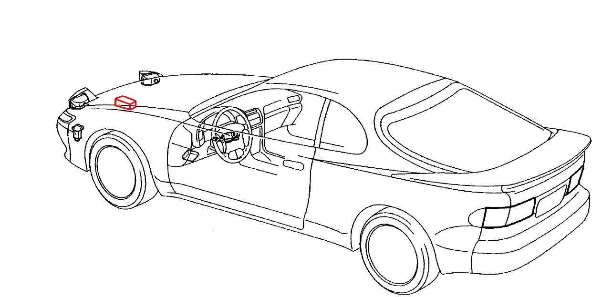

## Clarifications

This guide uses several terms to describe pop-up states and light switch positions. The sections below define them.

### Light Switch States

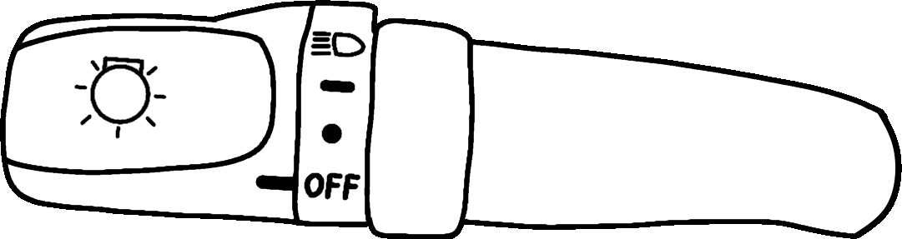

The light control switch in a T18 Celica has 4 positions, shown above. From top to bottom:

- `HEAD`
- `TAIL`
- `HOLD`
- `OFF`

The controller cannot distinguish between `TAIL` and `HOLD`. It treats both as `HOLD`.

### Pop-up States

- `UP`: Pop-up is in the fully up position
- `DOWN`: Pop-up is in the fully down or retracted position
- `IN-BETWEEN`: Pop-up is somewhere between `UP` and `DOWN`

## Pop-up Controller

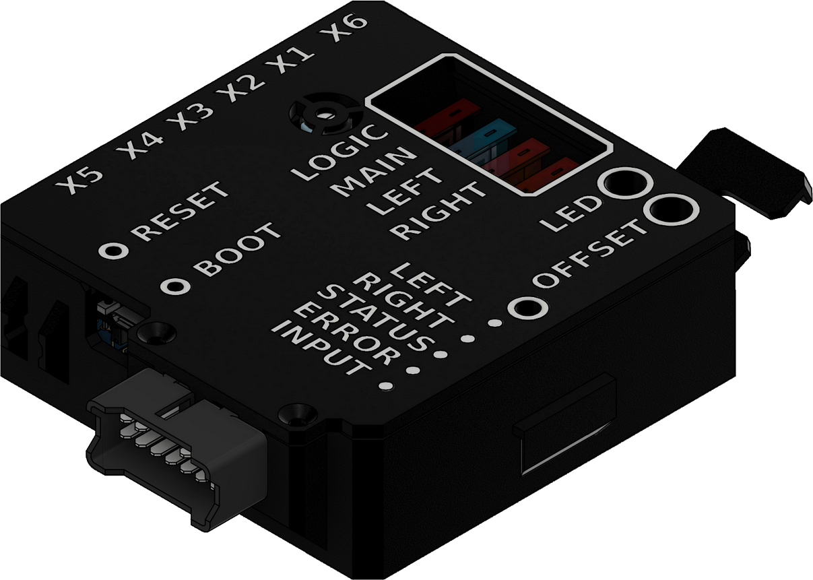

The controller is a plug-and-play replacement for the factory light retractor relay in a T18 Toyota Celica.

In theory it may also work with some other pop-up cars if a custom wiring adapter and mounting bracket are made.

The firmware source code is publicly available on GitHub: [sheep-celica/pop-up-controller-v10](https://github.com/sheep-celica/pop-up-controller-v10)

A desktop application is available for flashing new firmware, reading data, and changing settings. More details are in [Pop-up controller Application](#pop-up-controller-application).

### Fuses

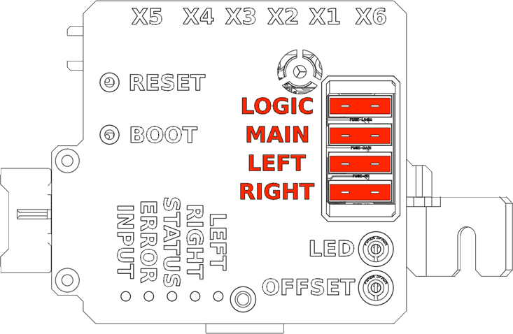

The controller has 4 replaceable automotive fuses on board. In general, increasing the fuse rating is not recommended.

The entire light retractor circuit is also protected by a **`30 A` RTR fuse** in the engine bay near the battery.

- **LOGIC:** `1 A`. Not recommended to increase. Protects the `3.3 V` and `12 V` rails, which includes everything except the pop-up motors.
- **MAIN:** `15 A`. Can be increased if needed. Protects everything after the power connector, including the main TVS diode.
- **LEFT:** `5 A`. Can be increased if needed. Protects the left pop-up motor.
- **RIGHT:** `5 A`. Can be increased if needed. Protects the right pop-up motor.

### Indicator LEDs

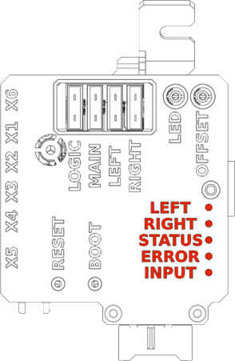

The top of the controller case contains 5 LEDs that show the controller state.

- **LEFT:** Green. Lights when the left pop-up is being powered.
- **RIGHT:** Green. Lights when the right pop-up is being powered.
- **STATUS:** Blue. Solid on when the controller is running. Flashes when the debug button is pressed.
- **ERROR:** Red. Turns on when an error occurs. This does not persist across power cycles. On startup it flashes the number of stored error codes, with `0` flashes if no errors are stored.
- **INPUT:** White. Flashes briefly when an input change is registered.

#### Additional LED Behaviors

- Rapid flashing of the `INPUT` and `STATUS` LEDs means battery voltage is below `7 V`. This should only happen when the controller is connected directly to a PC.
- All LEDs turn on for about 2 seconds at startup to confirm they work. This does not include the `LEFT` and `RIGHT` LEDs because those are hardwired to motor power.

### Buttons and Potentiometers

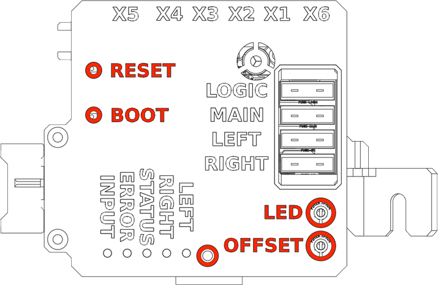

There are 3 buttons and 2 potentiometers accessible from the top of the controller case. The debug button is unlabeled and sits between the `OFFSET` potentiometer and the LEDs.

#### Buttons

- **RESET:** Brief press power cycles the controller.
- **BOOT:** Do not use this unless you are flashing firmware and running into issues. During flashing, it may need to be held for several seconds.
- **DEBUG:** Holding it for more than 5 seconds saves data and reboots the controller. If the light switch is in the `OFF` position, the controller will shut down. Pressing it 3 times quickly toggles whether sleepy eye mode can be used when the light switch is not in the `OFF` position. A brief press should make the `STATUS` LED blink to confirm the press was registered.

#### Potentiometers

- **LED:** Adjusts the brightness of the illumination LEDs in the wink buttons and sleepy eye controls.
- **OFFSET:** Adjusts timing of the RH pop-up when moving to the sleepy eye position.

### Connectors

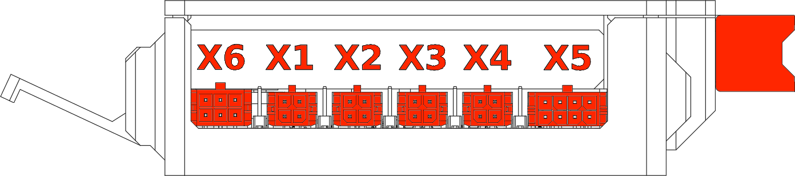

The controller includes the main car-harness connector, a `USB-C` connector for connecting the ESP32 to a computer, and 6 Micro-Fit accessory connectors labeled `X1` through `X6`.

#### Main Connector

12-pin Toyota connector for connecting to the T18 Celica light retractor circuit.

Uses the same connector and the same pinout as the original Light Retractor Relay.

#### Accessory Connectors

| Connector | Function | Notes |
| --- | --- | --- |
| `X1` | RH wink button connector |  |
| `X2` | LH wink button connector |  |
| `X3` | Both wink button connector |  |
| `X4` | Both toggle button connector | Similar to the both-wink function, but while the light switch is in `HOLD`, this button toggles pop-up positions between `UP` and `DOWN`. |
| `X5` | Sleepy eye controls connector |  |
| `X6` | Expansion connector | For connecting the remote receiver module. |

## Wink Buttons

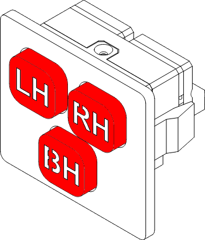

Up to 4 wink buttons can be connected to the controller at connectors `X1`, `X2`, `X3`, and `X4`. They all use the same connector type and their cables can be interchanged if needed.

Pressing a wink button makes one pop-up or both pop-ups wink.

The 4th button at `X4` is a toggle button.

### Wink Cycle

Wink cycle is triggered when any pop-up button is pressed and released.

Multiple wink cycles can be in progress at the same time. You can wink one pop-up while the other one is moving.

Wink cycle logic:

1. Move the pop-up to the opposite state. If the pop-up is `IN-BETWEEN`, it is treated as `UP`.
2. When the pop-up reaches the opposite state, move it back to its original state.

This also supports sleepy eye mode.

> **Sleepy eye support:** If a pop-up starts in the sleepy eye position, the wink cycle returns it to that same position at the end.

## Light Switch Behavior

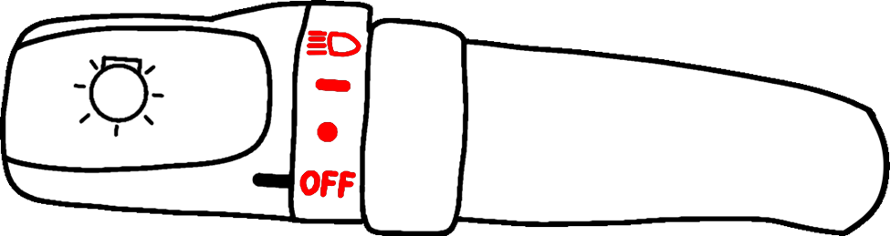

The controller responds to all light switch positions, but only `HEAD` and `OFF` actively change the pop-up target position.

| Position | Icon | Behavior |
| --- | --- | --- |
| `HEAD` |  | Pop-ups go `UP` |
| `TAIL` |  | No change to pop-up position |
| `HOLD` |  | No change to pop-up position |
| `OFF` |  | Pop-ups go `DOWN` |

> **Note:** `HOLD` and `TAIL` do not interrupt an in-progress move. They simply stop requesting a new position change.

## Sleepy Eye Mode

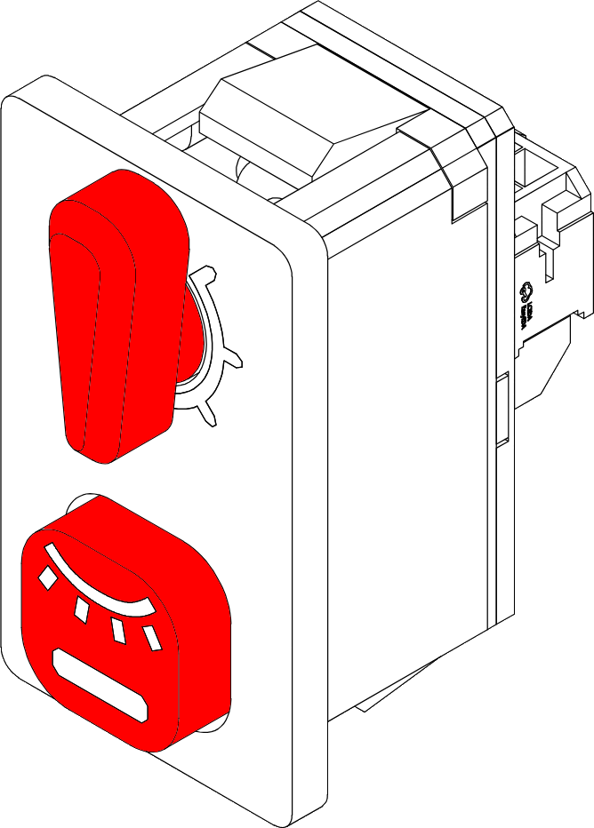

This mode can be toggled on and off with the button on the sleepy eye controls. The knob can be set to 1 of 7 positions to set the pop-up angle.

> **Default restriction:** By default, sleepy eye mode can only be enabled while the light switch is in the `OFF` position. This can be changed in the desktop app.

### Turning the Mode On

- An LED lights up under the sleepy eye button.
- The pop-ups go to the `UP` position and then continue moving for a set amount of time.
- Light switch controls no longer affect the pop-ups.
- Wink buttons still function.

> **Note:** The amount of extra travel time is set by the rotary switch on the sleepy eye controls.

### Turning the Mode Off

- The LED under the sleepy eye button turns off.
- Light switch controls regain normal pop-up control.
- If the light switch is in the `OFF` position, the pop-ups go `DOWN` right away.
- If the light switch is in the `HEAD` position, the pop-ups go `UP` right away.

### Adjusting RH Pop-up Offset

If the pop-ups do not end up at the same angle in sleepy eye mode, try adjusting the `OFFSET` potentiometer on the controller. See [Buttons and Potentiometers](#buttons-and-potentiometers).

The potentiometer adjusts RH pop-up timing and can add a fixed offset from `-50 ms` to `+50 ms`. The middle position is `0 ms`.

## Power On and Power Off

The controller is permanently powered whenever the light switch is in any position other than `OFF`.

Alternatively, holding a wink button or the sleepy eye toggle button will also power the controller for as long as the button is held.

When the controller is powered on, it will try to latch power as soon as possible. This takes about **`300 ms`**. Once the power is latched, the controller remains powered even if the light switch is moved to `OFF` and no buttons are being held.

While the controller is powered on, if the light switch remains in `OFF` and there is no pop-up movement, a countdown starts from **`86400 seconds`** (**`1 day`**). At the end of the countdown, the controller unlatches power and turns off. Before shutting down, it saves several non-critical values to persistent memory. Critical values that need to be saved, such as error codes, are written immediately when they occur.

Pressing any button, moving the light switch to another position, or receiving a remote signal that moves the pop-ups resets the countdown. The `86400` second timeout can be configured in the Pop-up controller Application.

> **After power off:** Pop-up state is not remembered, and sleepy eye mode does not remain active through a power cycle.

### Measured Power Draw

| Controller state | Power draw |
| --- | --- |
| Turned on | `< 30 mA`* |
| Turned off | `< 10 uA`* |

*These measurements were performed at `12 V`. Values can be slightly higher at lower voltages and slightly lower at higher voltages.*

While the pop-ups are moving, current draw can peak to several amps.

## Pop-up Controller Application

A desktop application has been developed to allow easy communication with the controller. It can:

- Read statistical data
- Read and clear errors
- Read and adjust settings
- Flash new firmware

Source code and `.exe` builds: [sheep-celica/Pop-up-controller-V10-Application](https://github.com/sheep-celica/Pop-up-controller-V10-Application)

Firmware releases: [sheep-celica/pop-up-controller-v10 releases](https://github.com/sheep-celica/pop-up-controller-v10/releases)

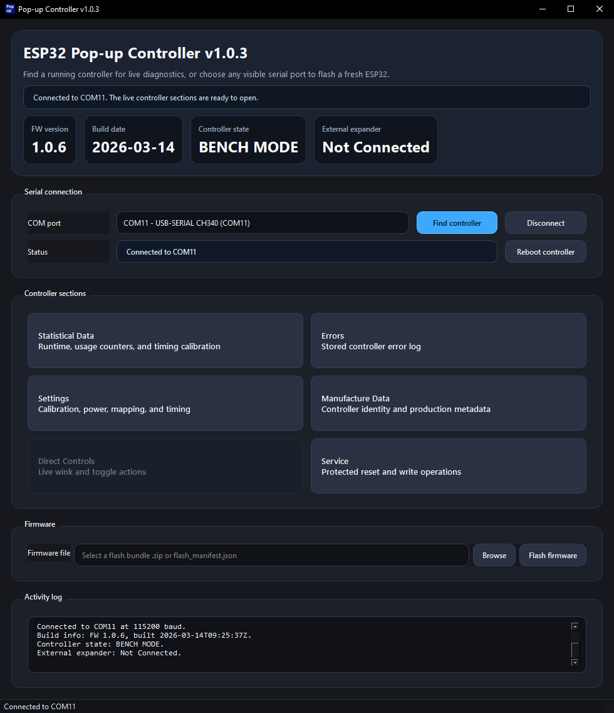

## Additional Features

### Pop-up Timeout

If a pop-up cannot reach its target position within `2.5 seconds`, it enters a timeout state and stops moving. The `ERROR` LED turns on and an error code is stored in the error log.

#### Clearing Timeout State

Use any one of the following methods to restart the controller and clear the timeout state:

- Disconnecting the battery
- Removing the RTR fuse
- Disconnecting the controller from the 12-pin connector on the wiring harness
- Removing the `MAIN` or `LOGIC` fuse from the controller
- Holding the debug button for more than 5 seconds

> **Note:** More safety features may be added in future firmware versions.

## Revision History

| Revision | Date | Description |
| --- | --- | --- |
| A | 2026-03-15 | Initial release |

