# User Guide - Revision E

## Safety

> **Important:** Always remove controller power before working on or near pop-ups. You can either: disconnect battery, remove RTR fuse, or disconnect the controller
> 
> **First-week check:** After installation, avoid driving at night or in poor visibility for at least the first week so you can confirm the controller is working correctly.
>
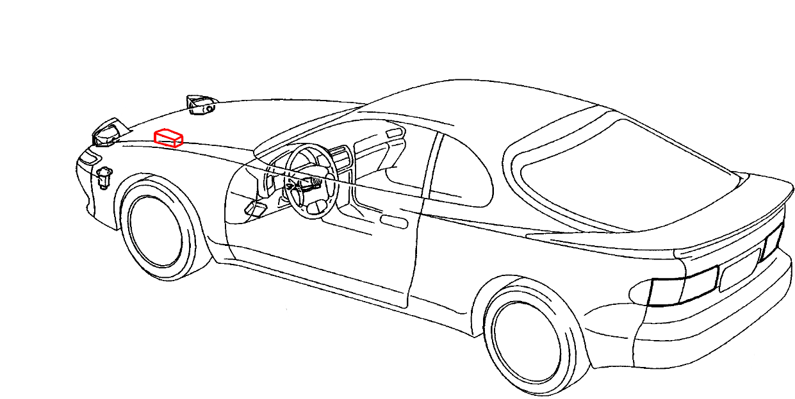

It is located on the left side of the battery.

## Behavior

### Light-Switch

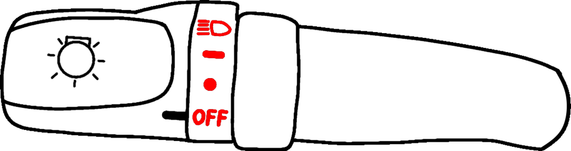

| Position | Icon | Behavior |
| --- | --- | --- |
| `HEAD` |  | Pop-ups go `UP` |
| `TAIL` |  | No change to pop-up position |
| `HOLD` |  | No change to pop-up position |
| `OFF` |  | Pop-ups go `DOWN` |

> **Warning:** Light-switch should be left in the `OFF` position when car is idle. Otherwise the controller will never enter sleep. See *PLACEHOLDER*

### Winking

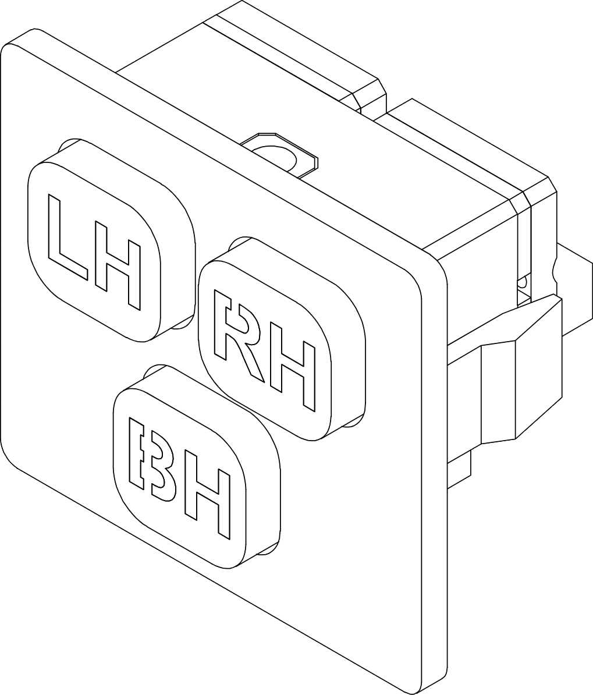

Winking makes a pop-up or both pop-ups go to the opposite state and then back. This can be done either pressing a wink button or by using remote controls.

#### Controller wink button connectors

| Connector | Function |
| --- | --- |
| `X1` | Winks RH pop-up |
| `X2` | Winks LH pop-up |
| `X3` | Winks Both pop-ups |
| `X4` | Toggles both pop-ups* |

> **Pop-up toggle:** Toggling a pop-up makes it go to the opposite position and stay there. For example if your Pop-ups are `UP` and you toggle them, they will go `DOWN` and stay there.
>
> **Exceptions:** If the light-switch is in the `OFF` or `HEAD` position or when Sleepy eye mode is active, the toggle will behave as a wink instead.

### Sleepy Eye Mode

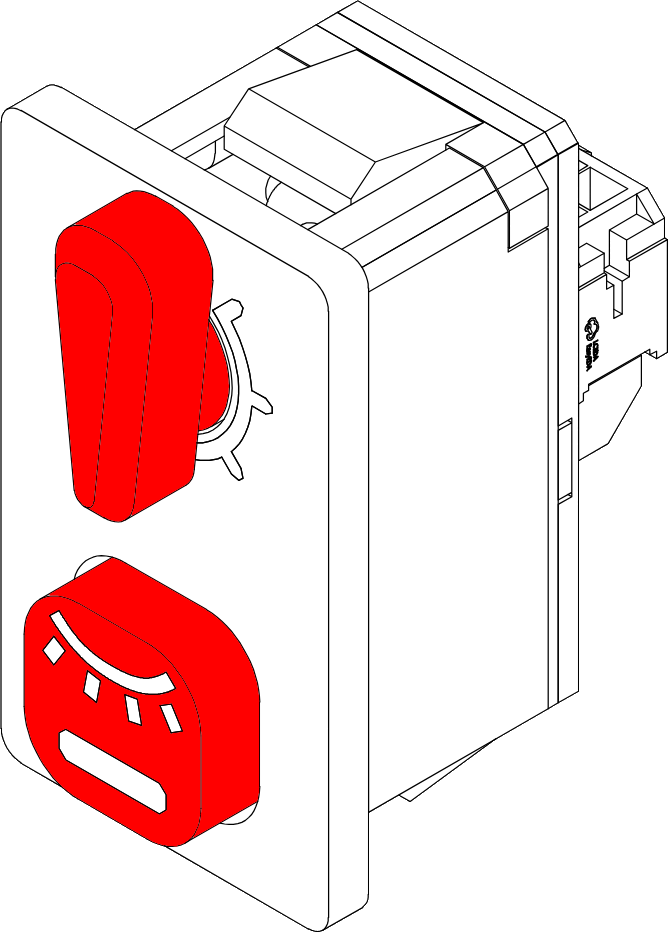

This mode allows pop-ups to reach a position between `UP` and `DOWN`.

#### Usage

Use the knob to choose one of the 7 available pop-up positions.

##### Activating

1. Press the button / remote control
2. Button LED turns on
3. Pop-ups move to the Sleepy Eye Mode position
4. Light-switch input is now ignored

##### De-activating

1. Press the button / remote control
2. Button LED turns off
3. Pop-ups are no longer restricted in the Sleepy Eye Mode position

> **Winking:** This mode supports Winking.

> **Restrictions:** This mode cannot be activated unless the light-switch is in the `OFF` position

### Remote Controls

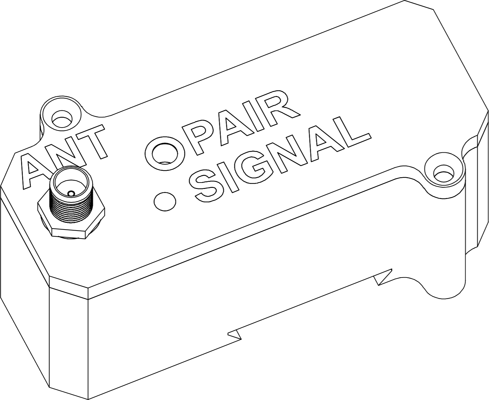
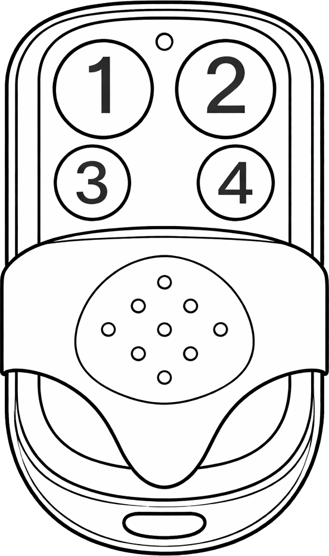

Optional addon for controlling your pop-ups from a distance. 
Up to 4 different inputs can be registered.

#### Default button mapping

| Button | Action |
| --- | --- |
| `1` | Wink RH pop-up |
| `2` | Wink LH pop-up |
| `3` | Wink Both pop-ups |
| `4` | Toggle Sleepy Eye Mode |

> **Note:** This is a separate module that can be added to your controller later.

> **Wake-up from sleep:** Remote inputs will work even while the controller sleeps.

## Controller

### Overview

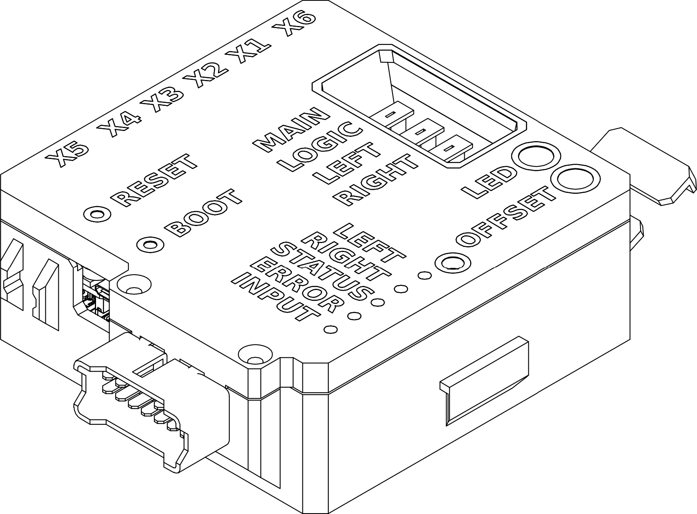

Plug and play replacement for the T18 Celica's light retractor relay with support for several accessories.

#### Features

- Fully custom PCB without relays
- 100% individual pop-up control
- Support for remote module addon
- Up to 4 wink buttons
- Custom Sleepy Eye Mode
- Tracks statistics
- Desktop app for data readout / setting changes

### Fuses

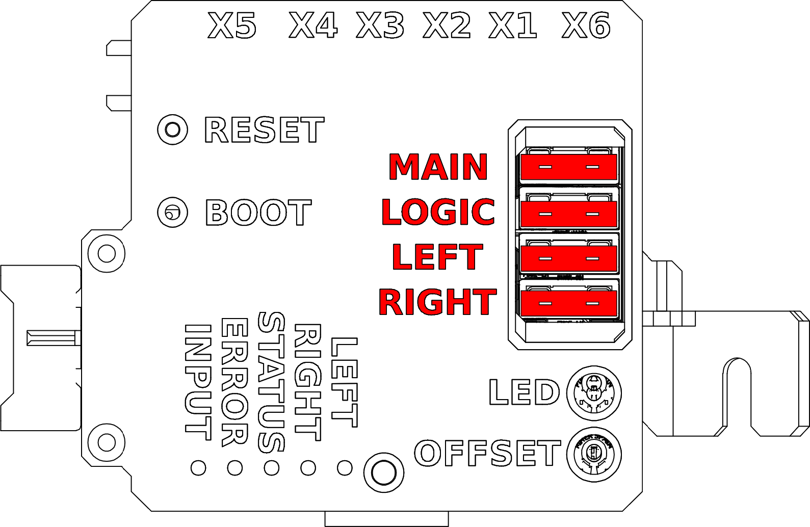

There are 4 replaceable automotive fuses on board.

- **MAIN — 20 A:** Main power fuse for the entire controller
- **LOGIC — 1 A:** Protects the non-motor 3.3V and 12V rails
- **LEFT — 10 A:** Fuse for the left pop-up motor
- **RIGHT — 10 A:** Fuse for the right pop-up motor

> **Warning:** Do not exceed fuse rating when replacing blown fuses.

### Indicator LEDs

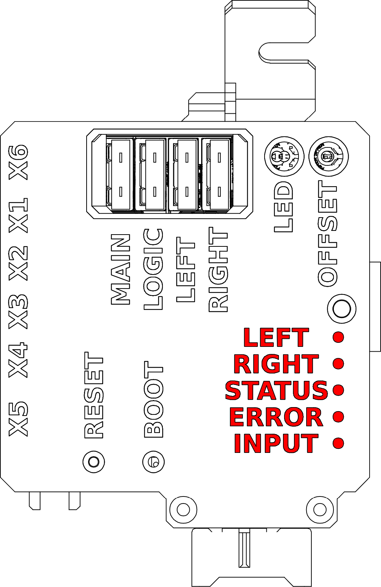

Several LEDs on the top of the controller case can help with troubleshooting.

- **Green — LEFT:** Lights up when the left pop-up motor is being powered.
- **Green — RIGHT:** Lights up when the right pop-up motor is being powered.
- **Blue — STATUS:** Lights up when the controller is running. Off during sleep. Flashing in debug mode.
- **Red — ERROR:** Turns on when an error occurs. After power on or wake-up from sleep, this LED will flash the amount of errors stored.
- **White — INPUT:** Flashes briefly when any input changes state (button press or release).

### Connectors

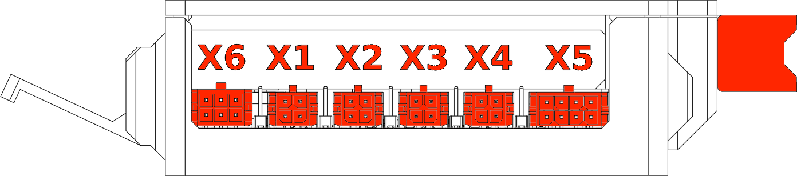

There are several connectors to connect additional accessories.

| Connector | Function |
| --- | --- |
| 12-pin Toyota Connector | Connects to the car's wiring harness |
| X1 | Right pop-up wink button |
| X2 | Left pop-up wink button |
| X3 | Both pop-ups wink button |
| X4 | Both pop-ups toggle button |
| X5 | Sleepy Eye Controls |
| X6 | I2C expansion / Remote control module |
| USB-C | Allows connecting controller to PC |

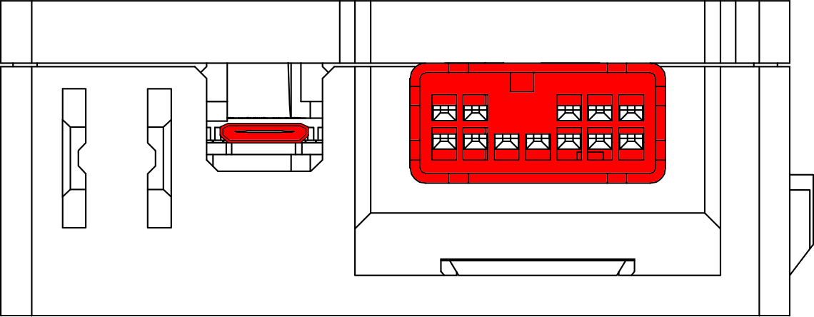

### Debug & Adjustment

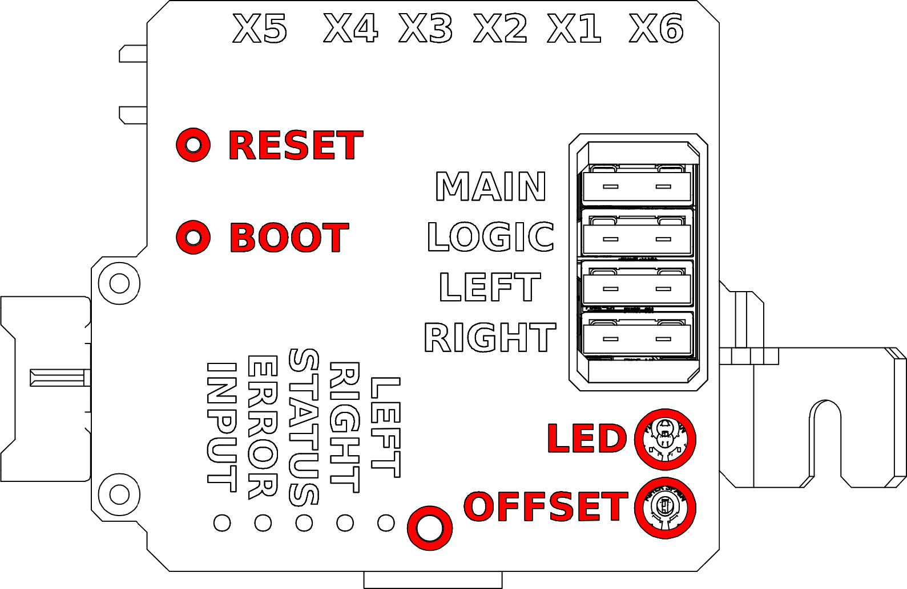

#### Buttons

- **RESET:** Reset button of the ESP32 module. Reboots the controller without saving data.
- **BOOT:** Can help during firmware flashing to enter boot mode
- **DEBUG:** Hold over 5 seconds to save data and reboot. Located between the Left LED and the potentiometers.

#### Potentiometers

- **LED:** Adjusts the LED brightness of the wink buttons and sleepy eye controls
- **OFFSET:** Adjusts offset of the RH pop-up in Sleepy Eye Mode

## Power draw

## Application

## Safety features

### Stall protection

- Controller detects stalls and disconnects motor power to prevent damage
- These events are stored in memory and trigger errors, blocking pop-up movement until reboot

### Timeout

- Pop-up movement will be stopped if it cannot reach the desired target within 2.5 seconds
- These events are stored in memory and trigger errors that block pop-up movement until reboot
- This prevents pop-ups moving forever in case of malfunctions

### Sleepy Eye mode restrictions

- Sleepy Eye mode can only be activated with the light-switch in the `OFF` position
- This prevents an accidental button press or hardware malfunction from effectively disabling your headlights while driving at night

### Remote control restrictions

- Remote controls are processed only when the light switch is in the `OFF` position
- Prevents accidental remote presses or some other remote signals from potentially controlling the headlights during drive

> **Work in progress:** Content below this point is temporary.

## Clarifications

This guide uses several terms to describe pop-up states and light switch positions. The sections below define them.

### Light Switch States

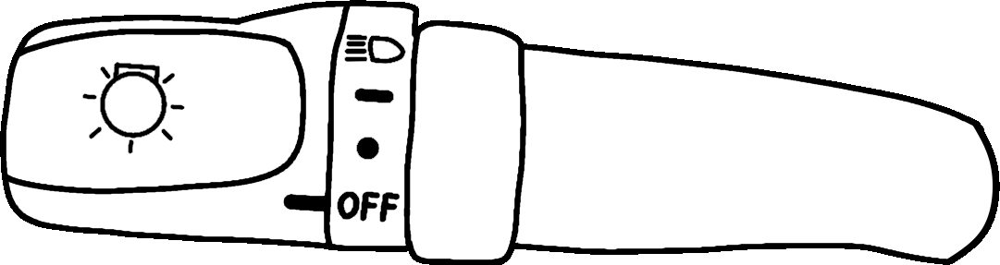

The light control switch in a T18 Celica has 4 positions, shown above. From top to bottom:

- `HEAD`
- `TAIL`
- `HOLD`
- `OFF`

The controller cannot distinguish between `TAIL` and `HOLD`. It treats both as `HOLD`.

### Pop-up States

- `UP`: Pop-up is in the fully up position
- `DOWN`: Pop-up is in the fully down or retracted position
- `IN-BETWEEN`: Pop-up is somewhere between `UP` and `DOWN`

## Pop-up Controller

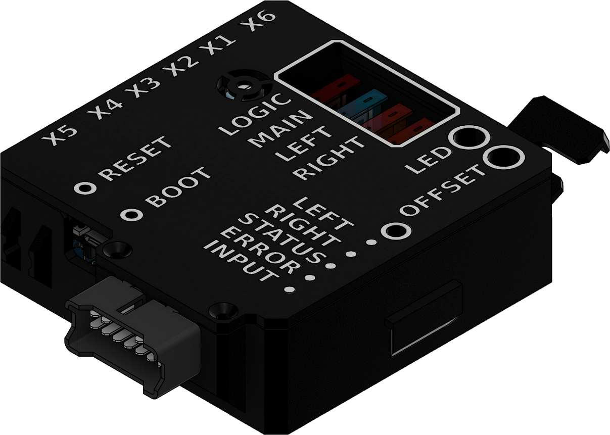

The controller is a plug-and-play replacement for the factory light retractor relay in a T18 Toyota Celica.

In theory it may also work with some other pop-up cars if a custom wiring adapter and mounting bracket are made.

### GitHub

The firmware source code is publicly available at [sheep-celica/pop-up-controller-v10](https://github.com/sheep-celica/pop-up-controller-v10).

A desktop application is available for flashing new firmware, reading data, and changing settings. More details are in [Pop-up controller Application](#pop-up-controller-application).

### Fuses

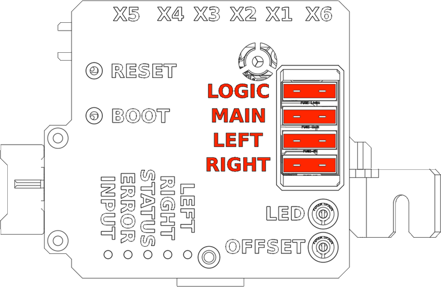

The controller has 4 replaceable automotive fuses on board. In general, increasing the fuse rating is not recommended.

The entire light retractor circuit is also protected by a **`30 A` RTR fuse** in the engine bay near the battery.

- **LOGIC:** `1 A`. Not recommended to increase. Protects the `3.3 V` and `12 V` rails, which includes everything except the pop-up motors.
- **MAIN:** `15 A`. Can be increased if needed. Protects everything after the power connector, including the main TVS diode.
- **LEFT:** `5 A`. Can be increased if needed. Protects the left pop-up motor.
- **RIGHT:** `5 A`. Can be increased if needed. Protects the right pop-up motor.

### Indicator LEDs

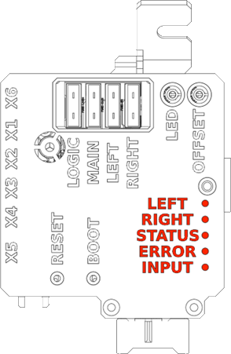

The top of the controller case contains 5 LEDs that show the controller state.

- **LEFT:** Green. Lights when the left pop-up is being powered.
- **RIGHT:** Green. Lights when the right pop-up is being powered.
- **STATUS:** Blue. Solid on when the controller is running. Flashes when the debug button is pressed.
- **ERROR:** Red. Turns on when an error occurs. This does not persist across power cycles. On startup it flashes the number of stored error codes, with `0` flashes if no errors are stored.
- **INPUT:** White. Flashes briefly when an input change is registered.

#### Additional LED Behaviors

- Rapid flashing of the `INPUT` and `STATUS` LEDs means battery voltage is below `7 V`. This should only happen when the controller is connected directly to a PC.
- All LEDs turn on for about 2 seconds at startup to confirm they work. This does not include the `LEFT` and `RIGHT` LEDs because those are hardwired to motor power.

### Buttons and Potentiometers

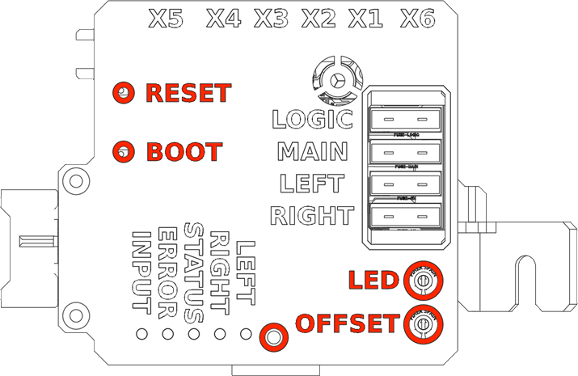

There are 3 buttons and 2 potentiometers accessible from the top of the controller case. The debug button is unlabeled and sits between the `OFFSET` potentiometer and the LEDs.

#### Buttons

- **RESET:** Brief press power cycles the controller.
- **BOOT:** Do not use this unless you are flashing firmware and running into issues. During flashing, it may need to be held for several seconds.
- **DEBUG:** Holding it for more than 5 seconds saves data and reboots the controller. If the light switch is in the `OFF` position, the controller will shut down. Pressing it 3 times quickly toggles whether sleepy eye mode can be used when the light switch is not in the `OFF` position. A brief press should make the `STATUS` LED blink to confirm the press was registered.

#### Potentiometers

- **LED:** Adjusts the brightness of the illumination LEDs in the wink buttons and sleepy eye controls.
- **OFFSET:** Adjusts timing of the RH pop-up when moving to the sleepy eye position.

### Connectors

The controller includes the main car-harness connector, a `USB-C` connector for connecting the ESP32 to a computer, and 6 Micro-Fit accessory connectors labeled `X1` through `X6`.

#### Main Connector

12-pin Toyota connector for connecting to the T18 Celica light retractor circuit.

Uses the same connector and the same pinout as the original Light Retractor Relay.

#### Accessory Connectors

| Connector | Function | Notes |
| --- | --- | --- |
| `X1` | RH wink button connector |  |
| `X2` | LH wink button connector |  |
| `X3` | Both wink button connector |  |
| `X4` | Both toggle button connector | Similar to the both-wink function, but while the light switch is in `HOLD`, this button toggles pop-up positions between `UP` and `DOWN`. |
| `X5` | Sleepy eye controls connector |  |
| `X6` | Expansion connector | For connecting the remote receiver module. |

## Wink Buttons

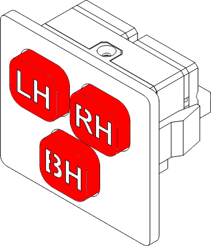

Up to 4 wink buttons can be connected to the controller at connectors `X1`, `X2`, `X3`, and `X4`. They all use the same connector type and their cables can be interchanged if needed.

Pressing a wink button makes one pop-up or both pop-ups wink.

The 4th button at `X4` is a toggle button.

### Wink Cycle

Wink cycle is triggered when any pop-up button is pressed and released.

Multiple wink cycles can be in progress at the same time. You can wink one pop-up while the other one is moving.

Wink cycle logic:

1. Move the pop-up to the opposite state. If the pop-up is `IN-BETWEEN`, it is treated as `UP`.
2. When the pop-up reaches the opposite state, move it back to its original state.

This also supports sleepy eye mode.

> **Sleepy eye support:** If a pop-up starts in the sleepy eye position, the wink cycle returns it to that same position at the end.

## Light Switch Behavior

The controller responds to all light switch positions, but only `HEAD` and `OFF` actively change the pop-up target position.

| Position | Icon | Behavior |
| --- | --- | --- |
| `HEAD` |  | Pop-ups go `UP` |
| `TAIL` |  | No change to pop-up position |
| `HOLD` |  | No change to pop-up position |
| `OFF` |  | Pop-ups go `DOWN` |

## Sleepy Eye Mode

This mode can be toggled on and off with the button on the sleepy eye controls. The knob can be set to 1 of 7 positions to set the pop-up angle.

> **Default restriction:** By default, sleepy eye mode can only be enabled while the light switch is in the `OFF` position. This can be changed in the desktop app.

### Turning the Mode On

- An LED lights up under the sleepy eye button.
- The pop-ups go to the `UP` position and then continue moving for a set amount of time.
- Light switch controls no longer affect the pop-ups.
- Wink buttons still function.

> **Note:** The amount of extra travel time is set by the rotary switch on the sleepy eye controls.

### Turning the Mode Off

- The LED under the sleepy eye button turns off.
- Light switch controls regain normal pop-up control.
- If the light switch is in the `OFF` position, the pop-ups go `DOWN` right away.
- If the light switch is in the `HEAD` position, the pop-ups go `UP` right away.

### Adjusting RH Pop-up Offset

If the pop-ups do not end up at the same angle in sleepy eye mode, try adjusting the `OFFSET` potentiometer on the controller. See [Buttons and Potentiometers](#buttons-and-potentiometers).

The potentiometer adjusts RH pop-up timing and can add a fixed offset from `-50 ms` to `+50 ms`. The middle position is `0 ms`.

## Power On and Power Off

The controller is permanently powered whenever the light switch is in any position other than `OFF`.

Alternatively, holding a wink button or the sleepy eye toggle button will also power the controller for as long as the button is held.

When the controller is powered on, it will try to latch power as soon as possible. This takes about **`300 ms`**. Once the power is latched, the controller remains powered even if the light switch is moved to `OFF` and no buttons are being held.

While the controller is powered on, if the light switch remains in `OFF` and there is no pop-up movement, a countdown starts from **`86400 seconds`** (**`1 day`**). At the end of the countdown, the controller unlatches power and turns off. Before shutting down, it saves several non-critical values to persistent memory. Critical values that need to be saved, such as error codes, are written immediately when they occur.

Pressing any button, moving the light switch to another position, or receiving a remote signal that moves the pop-ups resets the countdown. The `86400` second timeout can be configured in the Pop-up controller Application.

> **After power off:** Pop-up state is not remembered, and sleepy eye mode does not remain active through a power cycle.

### Measured Power Draw

| Controller state | Voltage | Power draw |
| --- | --- | --- |
| Turned on | `12 V` | `< 30 mA` |
| Turned off | `12 V` | `< 10 uA` |

> **Battery drain:** While the controller is awake, it roughly doubles the car's normal idle current draw, so the battery also drains about twice as fast during that time. If the light switch is left in the `OFF` position, the controller shuts itself down after `24 hours`. Once shut down, its own power draw drops to a negligible level, so in practice it typically shortens battery standby time by only about `1 day`.

## Pop-up Controller Application

A desktop application has been developed to allow easy communication with the controller. It can:

- Read statistical data
- Read and clear errors
- Read and adjust settings
- Flash new firmware

Desktop app downloads: [sheep-celica/Pop-up-controller-V10-Application releases](https://github.com/sheep-celica/Pop-up-controller-V10-Application/releases)

Firmware releases: [sheep-celica/pop-up-controller-v10 releases](https://github.com/sheep-celica/pop-up-controller-v10/releases)

Dedicated app guides:

- [App Setup Guide](app-setup.md)
- [App Flashing Guide](app-flashing.md)
- [App Usage Guide](app-usage.md)

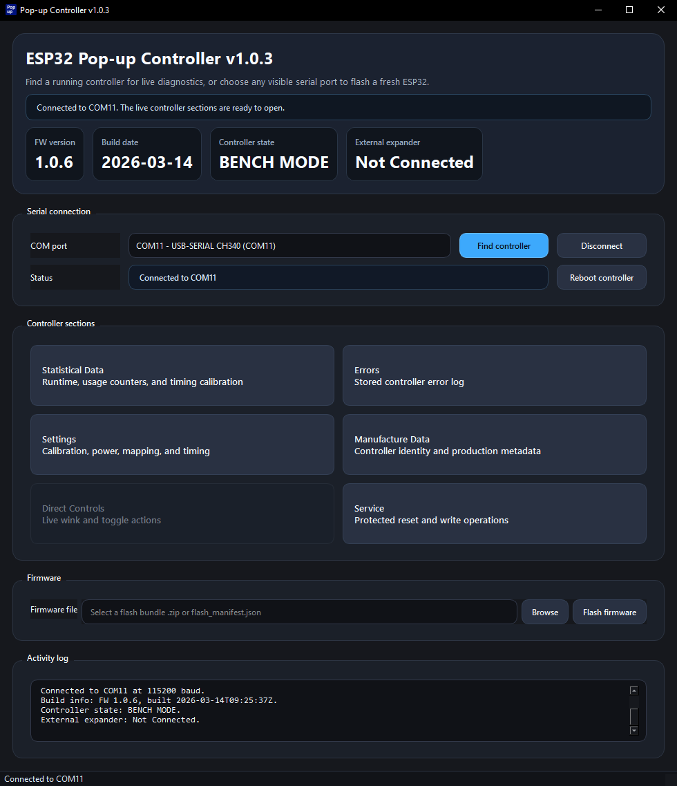

## Additional Features

### Pop-up Timeout

If a pop-up cannot reach its target position within `2.5 seconds`, it enters a timeout state and stops moving. The `ERROR` LED turns on and an error code is stored in the error log.

#### Clearing Timeout State

Use any one of the following methods to restart the controller and clear the timeout state:

- Disconnecting the battery
- Removing the RTR fuse
- Disconnecting the controller from the 12-pin connector on the wiring harness
- Removing the `MAIN` or `LOGIC` fuse from the controller
- Holding the debug button for more than 5 seconds

## Revision History

| Revision | Date | Description |
| --- | --- | --- |
| A | 2026-03-15 | Initial release |

